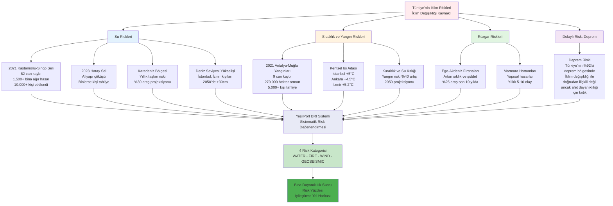
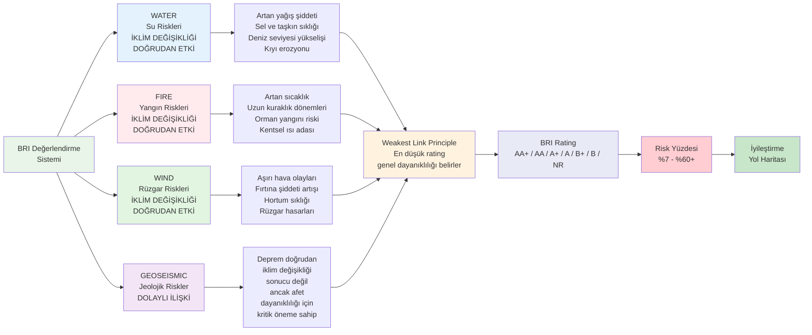
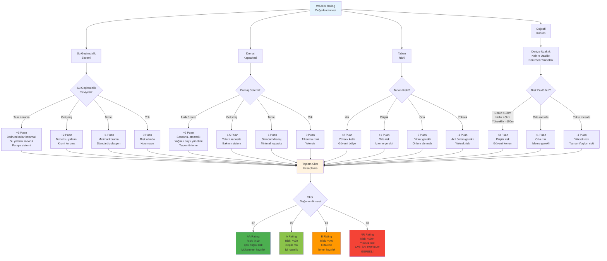
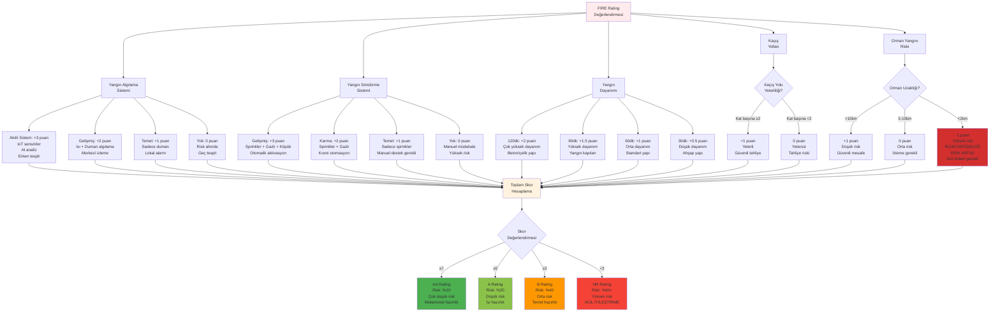
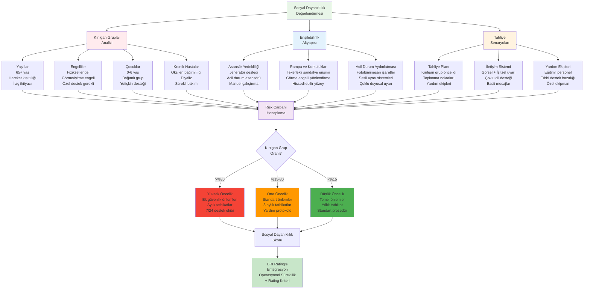
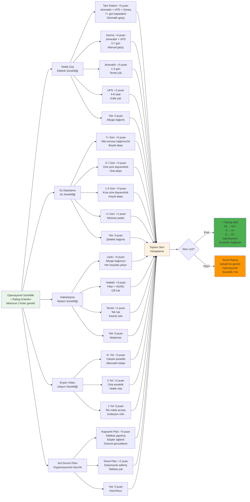
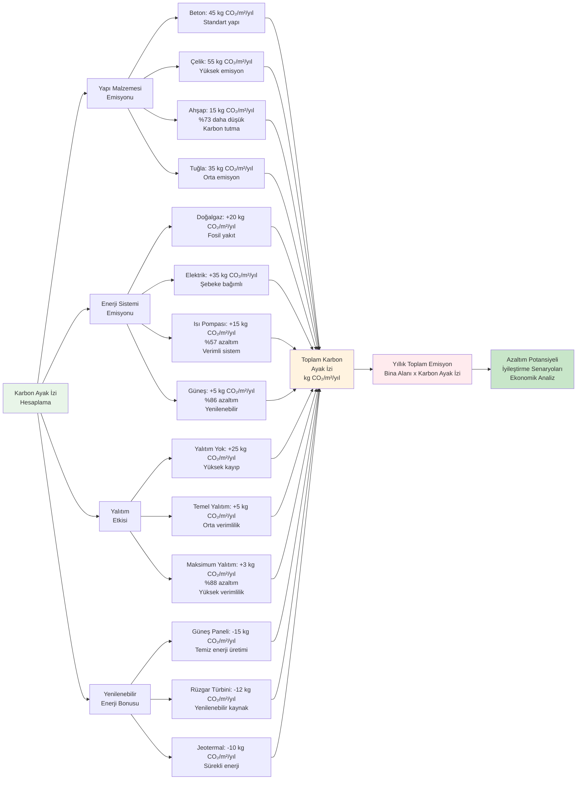
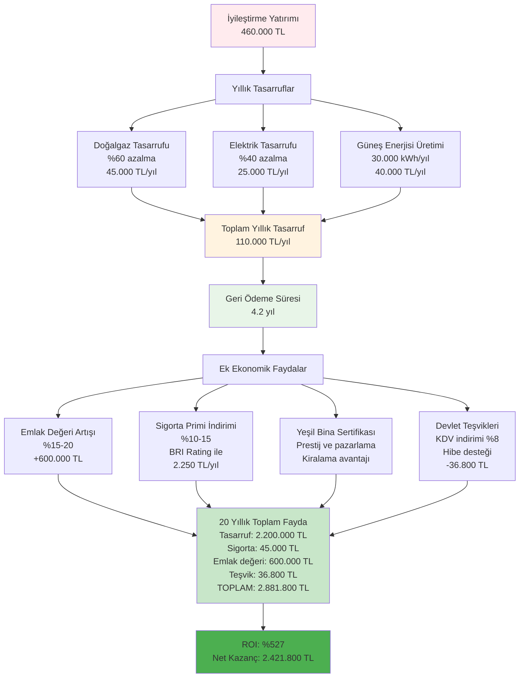
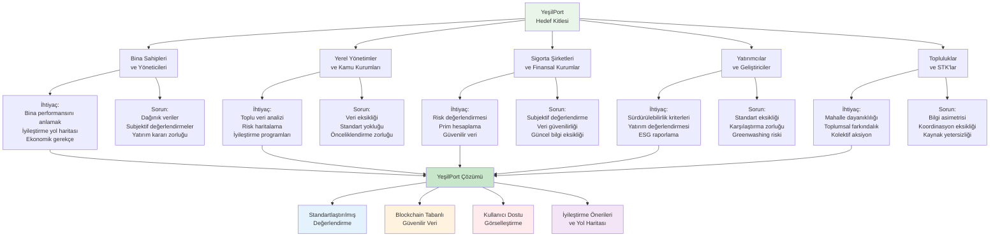
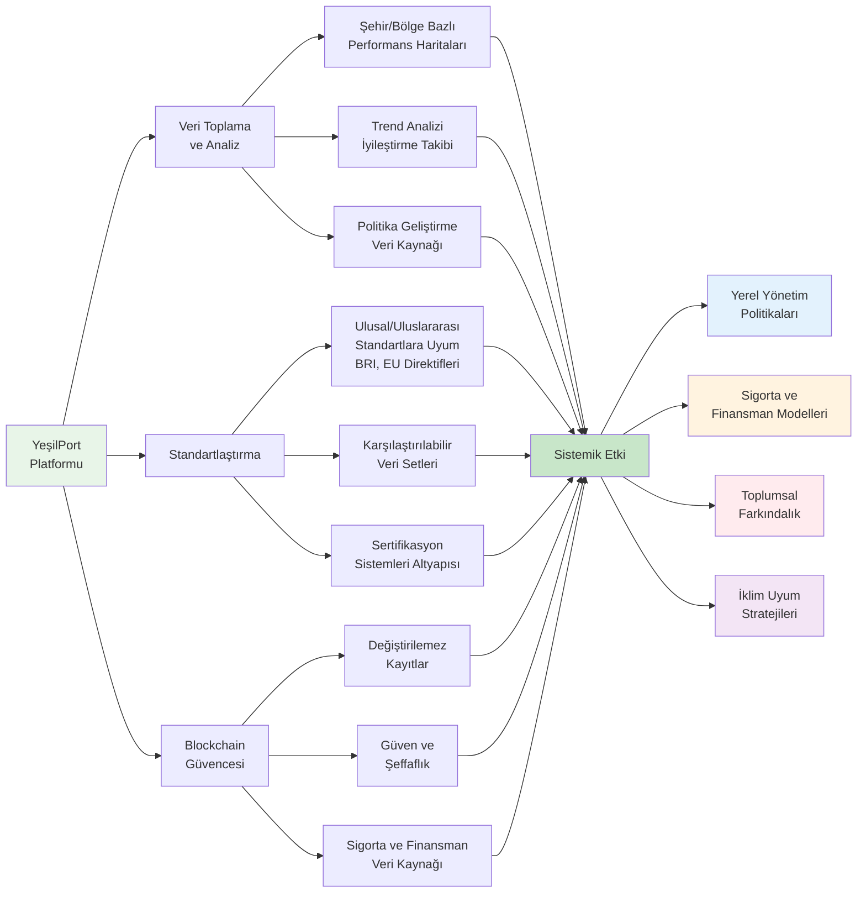

# YeşilPort: İklim Değişikliği ile Mücadele Bağlantısı

## Özet

YeşilPort, binaların iklim değişikliğine karşı dayanıklılığını ölçen dijital bina pasaportu platformudur. Proje, **ana eksen olarak Uyum & Dayanıklılık (Adaptation & Resilience)**, **ikincil katkı olarak Azaltım (Mitigation)** yaklaşımını benimser.

**Ana Eksen Seçimi Gerekçesi:**

Türkiye, iklim değişikliğinin etkilerini şiddetle yaşayan bir coğrafyadadır:
- 2021 Kastamonu-Sinop sel felaketi: 82 can kaybı, 1.500+ bina ağır hasar
- 2021 Manavgat-Marmaris orman yangınları: 9 can kaybı, 270.000 hektar orman
- 2023 Hatay sel felaketi: Altyapı çöküşü, binlerce kişi etkilendi
- Artan kentsel ısı adası etkisi: İstanbul, Ankara, İzmir'de +5°C sıcaklık artışı

YeşilPort, bu acil ihtiyaca yanıt vererek binaların dayanıklılığını ölçer, zayıf noktaları tespit eder ve iyileştirme yol haritası sunar. IFC World Bank Group'un Building Resilience Index (BRI) metodolojisini kullanarak sistematik risk değerlendirmesi yapar. Aynı zamanda, enerji verimliliği ve karbon ayak izi hesaplamaları ile azaltım hedeflerine de katkı sağlar.

---

## 1. Ana Eksen: Uyum & Dayanıklılık (Adaptation & Resilience)

### 1.1 Türkiye'nin İklim Değişikliği Riskleri

### 1.2 Building Resilience Index (BRI) Metodolojisi

YeşilPort, IFC World Bank Group'un BRI metodolojisini Türkiye'nin iklim gerçeklerine uyarlar. Sistem, dört ana risk kategorisinde değerlendirme yapar ve "Weakest Link Principle" (En Zayıf Halka Prensibi) ile binanın genel dayanıklılığını belirler.

**BRI Rating Sistemi ve Risk Seviyeleri:**

| Rating | Risk Yüzdesi | Operasyonel Süreklilik | Anlamı |
|--------|--------------|------------------------|--------|
| **AA+** | %7 | Var | Çok düşük risk, tam hazırlık |
| **AA** | %10 | Yok | Çok düşük risk |
| **A+** | %15 | Var | Düşük risk, iyi hazırlık |
| **A** | %20 | Yok | Düşük risk |
| **B+** | %35 | Var | Orta risk, temel hazırlık |
| **B** | %40 | Yok | Orta risk |
| **NR** | %60+ | Yok | Yüksek risk, acil iyileştirme gerekli |

### 1.3 WATER (Su) Dayanıklılığı - İklim Değişikliğinin Doğrudan Etkisi

**Türkiye'deki Durum ve Projeksiyonlar:**
- 2021 Kastamonu-Sinop seli: 82 can kaybı, 1.500+ bina ağır hasar, 10.000+ kişi etkilendi
- 2023 Hatay sel felaketi: Altyapı çöküşü, binlerce kişi tahliye edildi
- İklim projeksiyonları (2050): Karadeniz ve Akdeniz bölgelerinde %20-30 yağış artışı
- Deniz seviyesi yükselişi: İstanbul ve İzmir kıyılarında 2050'de +30cm bekleniyor

**YeşilPort'un Değerlendirme Sistemi:**

**Somut Örnek 1: Kastamonu Seli Senaryosu**

2021 Kastamonu selinde hasar gören bir apartman YeşilPort ile değerlendirilseydi:

**Mevcut Durum:**
- **Su Geçimsizlik:** Yok (0 puan) - Bodrum katlar korumasız, su yalıtımı yok
- **Drenaj Sistemi:** Temel (1 puan) - Yetersiz kapasite, tıkanma sorunu
- **Taban Riski:** Yüksek (-1 puan) - Dere yatağına 200m mesafede
- **Coğrafi Konum:** Nehir 500m (-1 puan) - Taşkın riski yüksek
- **Toplam Skor:** -1 puan → **NR Rating (Risk: %60+)**

**Gerçekleşen Hasar:**
- Bodrum ve zemin katlar tamamen su altında
- Elektrik ve ısıtma sistemleri kullanılamaz hale geldi
- 3 gün boyunca bina kullanılamadı
- Tamir maliyeti: 450.000 TL
- Sakinler 2 hafta tahliye edildi

**İyileştirme Önerileri ve Maliyet:**
1. Bodrum katlar için su geçimsizlik sistemi: 80.000 TL (+3 puan)
2. Gelişmiş drenaj sistemi kurulumu: 60.000 TL (+1.5 puan)
3. Tahliye pompası ve erken uyarı sistemi: 40.000 TL (+1 puan)
4. Zemin katta su baskınına dayanıklı malzemeler: 50.000 TL (+0.5 puan)
5. Elektrik panosu yükseltme: 20.000 TL (+0.5 puan)

**Toplam İyileştirme Maliyeti:** 250.000 TL  
**İyileştirme Sonrası Skor:** 5.5 puan → **A Rating (Risk: %20)**  
**Risk Azaltımı:** %67 (Risk %60+ → %20)

**Ekonomik Analiz:**
- Bir sonraki sel olayında beklenen hasar: 90.000 TL (önceki 450.000 TL)
- Sigorta primi indirimi: %12 (yıllık 3.600 TL tasarruf)
- 10 yıllık toplam tasarruf: 396.000 TL (hasar azaltımı + sigorta)
- **ROI:** %58 (10 yıl)
- **Geri ödeme süresi:** 5.2 yıl

**Sosyal Fayda:**
- Sakinler tahliye edilmek zorunda kalmaz
- Yaşlı ve engelli sakinler için güvenlik
- Psikolojik rahatlık ve yaşam kalitesi artışı

### 1.4 FIRE (Yangın) Dayanıklılığı - İklim Değişikliğinin Doğrudan Etkisi

**Türkiye'deki Durum ve Projeksiyonlar:**
- 2021 Manavgat-Marmaris yangınları: 9 can kaybı, 270.000 hektar orman, 5.000+ kişi tahliye
- Artan sıcaklık ve kuraklık: Yangın sezonunun uzaması (Haziran-Ekim)
- İklim projeksiyonları (2050): Akdeniz ve Ege'de %2-3°C sıcaklık artışı
- Yangın riski artışı: %40 (2050 projeksiyonu)
- Kentsel ısı adası etkisi: İstanbul +5°C, Ankara +4.5°C, İzmir +5.2°C

**YeşilPort'un Değerlendirme Sistemi:**

**Somut Örnek 2: Manavgat Yangını Senaryosu**

2021 Manavgat yangınında zarar gören bir otel YeşilPort ile değerlendirilseydi:

**Mevcut Durum:**
- **Yangın Algılama:** Temel (1 puan) - Sadece duman algılama, geç tespit
- **Yangın Söndürme:** Temel (1 puan) - Sadece sprinkler, yetersiz kapasit e
- **Yangın Dayanımı:** 60dk (1 puan) - Orta dayanım, ahşap detaylar
- **Kaçış Yolları:** Yetersiz (0 puan) - 5 kat, 1 merdiven, dar koridor
- **Orman Uzaklığı:** 800m (-1 puan) - **Yüksek risk, iklim değişikliği ile artan tehlike**
- **Toplam Skor:** 2 puan → **NR Rating (Risk: %60+)**

**Gerçekleşen Hasar:**
- Otel tamamen yandı, kullanılamaz hale geldi
- 120 misafir tahliye edildi, 3 kişi yaralandı
- Toplam hasar: 15 milyon TL
- İşletme 2 yıl kapalı kaldı
- Gelir kaybı: 8 milyon TL

**İyileştirme Önerileri ve Maliyet:**
1. Gelişmiş yangın algılama sistemi (IoT + AI): 250.000 TL (+2 puan)
2. Karma söndürme sistemi (sprinkler + gazlı): 400.000 TL (+2 puan)
3. İkinci kaçış merdiveni ve acil çıkış genişletme: 600.000 TL (+1 puan)
4. Yangına dayanıklı peyzaj (ateş kesici bitki örtüsü): 150.000 TL (+0.5 puan)
5. Erken uyarı sistemi (orman yangını izleme): 100.000 TL (+0.5 puan)
6. Yangın dayanımı artırma (yangın kapıları, bölmeleme): 500.000 TL (+0.5 puan)

**Toplam İyileştirme Maliyeti:** 2.000.000 TL  
**İyileştirme Sonrası Skor:** 8.5 puan → **AA Rating (Risk: %10)**  
**Risk Azaltımı:** %83 (Risk %60+ → %10)

**Ekonomik Analiz:**
- Bir sonraki yangın olayında beklenen hasar: 2.5 milyon TL (önceki 15 milyon TL)
- Sigorta primi indirimi: %15 (yıllık 180.000 TL tasarruf)
- İşletme kesintisi riski: %90 azalma
- 10 yıllık toplam tasarruf: 14.3 milyon TL (hasar azaltımı + sigorta + gelir kaybı önleme)
- **ROI:** %615 (10 yıl)
- **Geri ödeme süresi:** 1.6 yıl

**Sosyal Fayda:**
- 120 misafir ve 40 çalışanın can güvenliği
- Bölge turizmine katkı (süreklilik)
- İstihdam korunması
- Toplumsal güven artışı

**İklim Değişikliği Bağlantısı:**
- Orman yangını riski 2050'de %40 artacak
- Yangın sezonu 2 ay uzayacak (Mayıs-Kasım)
- Sıcaklık artışı ile kuraklık dönemleri uzayacak
- YeşilPort'un erken uyarı sistemi entegrasyonu ile iklim değişikliği risklerine proaktif hazırlık

### 1.5 Sosyal Boyut: Kırılgan Gruplar ve Erişilebilirlik

YeşilPort, iklim değişikliğinin etkilerine karşı en savunmasız grupları özel olarak değerlendirir. Bu yaklaşım, sosyal adalet ve kapsayıcılık prensiplerini iklim uyum stratejilerine entegre eder.

**Kırılgan Gruplar:**
- **Yaşlılar (65+ yaş):** Hareket kısıtlılığı, kronik hastalıklar, ilaç bağımlılığı
- **Engelliler:** Fiziksel engel, görme/işitme engeli, bilişsel engel
- **Çocuklar (0-6 yaş):** Bağımlı grup, tahliye desteği gerekli
- **Kronik Hastalar:** Oksijen bağımlılığı, diyaliz, sürekli ilaç kullanımı
- **Düşük Gelir Grupları:** İyileştirme yatırımı yapamama, sigorta eksikliği

**Somut Örnek 3: Yaşlı Bakım Evi - Sosyal Dayanıklılık Değerlendirmesi**

İstanbul Kadıköy'de bir yaşlı bakım evi (80 sakin, 65-95 yaş arası):

**Mevcut Durum:**
- **Kırılgan Grup Oranı:** %100 (tüm sakinler 65+ yaş, %40'ı hareket kısıtlı)
- **Erişilebilirlik:** Asansör var, ancak jeneratör yok
- **Tahliye Planı:** Mevcut, ancak tatbikat yapılmamış
- **WATER Rating:** B (sel riski orta, Moda kıyısına 500m)
- **FIRE Rating:** A (yangın sistemleri iyi)
- **Operasyonel Süreklilik:** Yok (yedek güç, su depolama yetersiz)

**Risk Analizi:**
- Elektrik kesintisinde asansör çalışmaz → 4. katta 20 yaşlı mahsur kalır
- Tahliye süresi: Normal bina 5 dk, bu bina 25 dk (hareket kısıtlılığı)
- Kronik hastalar: 15 kişi oksijen bağımlı, 8 kişi diyaliz hastası
- **Sosyal Risk Çarpanı:** x2.5 (kırılgan grup yoğunluğu)
- **Genel BRI Rating:** B (Risk: %40) → **Sosyal Risk ile: %100 (Kritik)**

**İyileştirme Önerileri ve Maliyet:**
1. Jeneratör kurulumu (asansör + tıbbi ekipman desteği): 180.000 TL
2. Zemin kat acil barınma alanı (20 kişilik): 120.000 TL
3. Aylık tahliye tatbikatları ve personel eğitimi: 60.000 TL/yıl
4. Tıbbi ekipman yedekleme (oksijen, ilaç, 7 gün): 80.000 TL
5. Erken uyarı sistemi (sel, yangın, deprem): 70.000 TL
6. Tekerlekli sandalye erişimi iyileştirme: 50.000 TL
7. Acil durum iletişim sistemi (görsel + işitsel): 40.000 TL

**Toplam İyileştirme Maliyeti:** 600.000 TL (ilk yıl)  
**İyileştirme Sonrası:**
- **BRI Rating:** A+ (Risk: %15)
- **Sosyal Risk Çarpanı:** x1.2 (iyileştirilmiş hazırlık)
- **Genel Risk:** %18 (önceki %100)
- **Risk Azaltımı:** %82

**Ekonomik ve Sosyal Fayda:**
- Yaşlıların can güvenliği (paha biçilemez)
- Ailelerin psikolojik rahatlığı
- Kurum itibarı ve doluluk oranı artışı (%95 → %100)
- Sigorta primi indirimi: %12 (yıllık 36.000 TL)
- Devlet teşvikleri: Yaşlı bakım tesisleri için %50 hibe desteği (300.000 TL)
- **Net Maliyet:** 300.000 TL
- **Geri ödeme süresi:** 8.3 yıl (sigorta tasarrufu ile)

**İklim Değişikliği Bağlantısı:**
- Aşırı sıcaklık dalgaları: Yaşlılar en riskli grup (kalp krizi, sıcak çarpması)
- Sel ve taşkın: Hareket kısıtlılığı nedeniyle tahliye zorluğu
- Elektrik kesintileri: Tıbbi ekipman bağımlılığı (oksijen, diyaliz)
- YeşilPort'un sosyal dayanıklılık değerlendirmesi, iklim adaletini sağlar

### 1.6 Operasyonel Süreklilik - Afet Sonrası Dayanıklılık

İklim değişikliği kaynaklı aşırı hava olaylarında binaların işlevselliğini sürdürmesi kritiktir. YeşilPort, operasyonel süreklilik önlemlerini değerlendirerek "+" rating verir.

**Somut Örnek 4: Hastane - Operasyonel Süreklilik Değerlendirmesi**

İzmir Karşıyaka'da bir devlet hastanesi (200 yatak, günlük 500 hasta):

**Mevcut Durum (2021 İzmir Depremi Sonrası):**
- **Yedek Güç:** Jeneratör (3 puan) - 48 saat kapasitesi, sadece kritik yük
- **Su Depolama:** 2 gün (3 puan) - Yetersiz, ameliyathane öncelikli
- **Haberleşme:** Yedekli (3 puan) - Fiber + 4G, kesinti yaşandı
- **Erişim Yolları:** 2 yol (2 puan) - Ana cadde + servis yolu
- **Acil Durum Planı:** Kapsamlı (5 puan) - Düzenli tatbikat, eğitimli ekip
- **Toplam Skor:** 16 puan → **+ Rating Aktif**

**Temel BRI Rating:** A (Risk: %20)  
**Operasyonel Süreklilik ile:** A+ (Risk: %15)  
**Risk Azaltımı:** %25

**2021 İzmir Depremi Deneyimi:**
- Elektrik kesintisi: 6 saat (jeneratör devreye girdi)
- Su kesintisi: 12 saat (depo yeterli oldu)
- Haberleşme kesintisi: 2 saat (4G'ye geçildi)
- Ameliyatlar kesintisiz devam etti
- Acil servis tam kapasite çalıştı
- **Sonuç:** Hastane işlevselliğini sürdürdü, can kaybı olmadı

**İyileştirme Önerileri ve Maliyet:**
1. Güneş paneli + batarya depolama (7 gün kapasitesi): 2.500.000 TL (+2 puan)
2. Su depolama artırımı (7 gün, 500m³): 800.000 TL (+2 puan)
3. Uydu haberleşme yedekliliği: 300.000 TL (+2 puan)
4. Üçüncü erişim yolu (helikopter pisti): 1.500.000 TL (+1 puan)
5. Acil durum planı güncelleme (iklim senaryoları): 100.000 TL

**Toplam İyileştirme Maliyeti:** 5.200.000 TL  
**İyileştirme Sonrası Skor:** 23 puan  
**İyileştirme Sonrası Rating:** AA+ (Risk: %7)  
**Risk Azaltımı:** %65 (Risk %20 → %7)

**Ekonomik ve Sosyal Fayda:**
- Afet sonrası 7 gün bağımsız çalışma kapasitesi
- Yıllık 182.500 hasta hizmeti kesintisiz
- Ameliyat ve acil servis sürekliliği
- Bölge sağlık güvenliği
- Sigorta primi indirimi: %15 (yıllık 450.000 TL)
- Devlet teşvikleri: Kritik altyapı için %60 hibe (3.120.000 TL)
- **Net Maliyet:** 2.080.000 TL
- **Geri ödeme süresi:** 4.6 yıl

**İklim Değişikliği Bağlantısı:**
- Aşırı hava olayları sıklığı artıyor (sel, fırtına, sıcak dalgası)
- Altyapı kesintileri daha sık ve uzun sürüyor
- Hastanelerin operasyonel sürekliliği can kurtarıcı
- YeşilPort'un değerlendirmesi, kritik altyapıların iklim dayanıklılığını sağlar

---

## 2. İkincil Katkı: Azaltım (Mitigation)

YeşilPort'un ikincil odağı, binaların karbon emisyonlarını azaltmak ve enerji verimliliğini artırmaktır. Bu yaklaşım, dayanıklılık iyileştirmeleriyle sinerjik olarak çalışır.

### 2.1 Karbon Ayak İzi Hesaplama - Nicel Etki Analizi

**Hesaplama Metodolojisi:**

**Nicel Azaltım Potansiyeli - Bina Tiplerine Göre:**

| Bina Tipi | Mevcut Durum (kg CO₂/m²/yıl) | İyileştirme Sonrası | Azaltım | Yıllık Tasarruf (100m² için) | Ekonomik Değer (20 yıl) |
|-----------|------------------------------|---------------------|---------|------------------------------|-------------------------|
| **Eski Apartman (1980 öncesi)** | 85 | 35 | **%59** | 5 ton CO₂/yıl | 100 ton CO₂ |
| **Orta Yaş Apartman (1980-2010)** | 65 | 30 | **%54** | 3.5 ton CO₂/yıl | 70 ton CO₂ |
| **Yeni Bina (2010+)** | 45 | 20 | **%56** | 2.5 ton CO₂/yıl | 50 ton CO₂ |
| **Ofis Binası** | 75 | 25 | **%67** | 50 ton CO₂/yıl (1000m²) | 1.000 ton CO₂ |
| **Alışveriş Merkezi** | 95 | 40 | **%58** | 550 ton CO₂/yıl (10.000m²) | 11.000 ton CO₂ |

**Somut Örnek 5: Eski Apartman İyileştirmesi - Ekonomik Motivasyon**

İstanbul Kadıköy'de 1975 yapımı 8 katlı apartman (800m², 16 daire):

**Mevcut Durum:**
- **Yapı:** Beton (45 kg CO₂/m²)
- **Yalıtım:** Yok (+25 kg CO₂/m²)
- **Isıtma:** Doğalgaz kombi (+20 kg CO₂/m²)
- **Pencere:** Tek cam (ek %20 tüketim)
- **Aydınlatma:** Fluoresan (orta verimlilik)
- **Toplam:** 85 kg CO₂/m²/yıl = **68 ton CO₂/yıl**
- **Yıllık Enerji Maliyeti:** 180.000 TL (doğalgaz + elektrik)

**İyileştirme Paketi ve Maliyet:**

1. **Dış Cephe Yalıtımı (Taş Yünü, 10cm):** 120.000 TL
   - Azaltım: -22 kg CO₂/m²
   - Doğalgaz tasarrufu: %60

2. **Çift Cam Pencere (Low-E):** 80.000 TL
   - Azaltım: -8 kg CO₂/m²
   - Isı kaybı azaltımı: %30

3. **Kombi Yenileme (Yoğuşmalı):** 40.000 TL
   - Azaltım: -5 kg CO₂/m²
   - Verimlilik artışı: %25

4. **Çatı Güneş Paneli (20 kW):** 200.000 TL
   - Azaltım: -15 kg CO₂/m²
   - Elektrik üretimi: 30.000 kWh/yıl

5. **LED Aydınlatma (Ortak Alanlar):** 20.000 TL
   - Azaltım: -3 kg CO₂/m²
   - Elektrik tasarrufu: %40

**Toplam Yatırım:** 460.000 TL

**İyileştirme Sonrası:**
- **Toplam:** 32 kg CO₂/m²/yıl = **25.6 ton CO₂/yıl**
- **Azaltım:** %62 (42.4 ton CO₂/yıl)
- **20 Yıllık Etki:** 848 ton CO₂ azaltımı (178 araç/yıl eşdeğeri)
- **Yıllık Enerji Maliyeti:** 70.000 TL (110.000 TL tasarruf)

**Ekonomik Analiz:**

**Sigorta ve Kredi Avantajları:**

1. **Sigorta Primi İndirimi (BRI Rating ile):**
   - AA+ Rating: %15 indirim
   - AA/A+ Rating: %12 indirim
   - A/B+ Rating: %8 indirim
   - **Örnek:** 800m² apartman, yıllık 15.000 TL prim → 2.250 TL tasarruf (AA+ ile)

2. **Yeşil Kredi Avantajları:**
   - %0.5-1 puan faiz indirimi
   - Daha yüksek kredi limiti (%20 artış)
   - Uzun vade seçenekleri (10 yıla kadar)
   - **Örnek:** 500.000 TL kredi, 5 yıl, %1 faiz indirimi → 25.000 TL faiz tasarrufu

3. **Emlak Değeri Artışı:**
   - Enerji sınıfı A+: %20 değer artışı
   - BRI Rating AA+: %15 değer artışı
   - **Örnek:** 3.000.000 TL değerli apartman → 1.050.000 TL değer artışı

**Toplam Ekonomik Fayda (20 yıl):**
- Enerji tasarrufu: 2.200.000 TL
- Sigorta indirimi: 45.000 TL
- Kredi faiz tasarrufu: 25.000 TL
- Emlak değeri artışı: 1.050.000 TL
- Devlet teşvikleri: 36.800 TL
- **Toplam:** 3.356.800 TL
- **Yatırım:** 460.000 TL
- **Net Kazanç:** 2.896.800 TL
- **ROI:** %630

**Çevresel Etki:**
- 20 yıllık karbon azaltımı: 848 ton CO₂
- Eşdeğer: 178 araç/yıl emisyonu
- Eşdeğer: 38.000 ağaç dikimi
- Türkiye'nin 2053 net sıfır hedefine katkı

---

## 3. Hizmet Tasarımı Perspektifi

### 3.1 Kullanıcı Deneyimi ve İhtiyaç Analizi

**Hedef Kitle ve İhtiyaçları:**

### 3.2 Davranış Değişikliği Mekanizmaları

**1. Bilinçlendirme ve Farkındalık:**
- Görsel skorlar ve rating'ler (BRI, Enerji Sınıfı, Karbon Ayak İzi)
- Karşılaştırmalı analiz imkanı (mahalle, şehir, ülke ortalaması)
- Risk yüzdesi ve kategorik değerlendirmeler
- İnteraktif diyagramlar ve grafikler

**2. Teşvik ve Ödüllendirme:**
- Yüksek BRI rating'leri için dijital rozetler
- İyileştirme önerileri ve sonraki seviye gereksinimleri
- Blockchain'de kalıcı ve doğrulanabilir kayıt
- Sosyal medya paylaşım özellikleri

**3. Ekonomik Motivasyon:**
- Detaylı maliyet-fayda analizi
- Geri ödeme süresi hesaplama
- Sigorta ve kredi avantajları gösterimi
- Emlak değeri artışı projeksiyonu

**4. Sosyal Baskı ve Rekabet:**
- Binalar arası karşılaştırma
- Mahalle dayanıklılık skoru
- Liderlik tablosu (anonim veya açık)
- Toplumsal tanınma ve prestij

**5. Erişilebilirlik ve Kapsayıcılık:**
- Basit ve anlaşılır arayüz
- Mobil uyumlu tasarım
- Çoklu dil desteği (Türkçe, İngilizce, Arapça)
- Ücretsiz temel değerlendirme

### 3.3 Sistemik Dönüşüm Potansiyeli

---

## 4. Sonuç ve Etki Değerlendirmesi

### 4.1 İklim Değişikliği ile Mücadele Katkısı

**Ana Eksen: Uyum & Dayanıklılık (%70 Odak)**
- BRI metodolojisi ile sistematik risk değerlendirmesi
- İklim değişikliği kaynaklı aşırı hava olaylarına hazırlık (sel, yangın, fırtına)
- Türkiye'ye özgü iklim riskleri ile somut bağlantı (Kastamonu seli, Manavgat yangını)
- Sosyal dayanıklılık: Kırılgan gruplar, erişilebilirlik, tahliye senaryoları
- Operasyonel süreklilik: Afet sonrası işlevsellik
- Toplumsal düzeyde dayanıklılık planlaması için veri kaynağı

**İkincil Katkı: Azaltım (%30 Odak)**
- Karbon ayak izi hesaplama ve izleme ile emisyon farkındalığı
- Nicel azaltım potansiyeli: %54-67 (bina tiplerine göre)
- Enerji verimliliği sınıflandırması ile tüketim azaltımı
- Ekonomik motivasyon: Geri ödeme süresi 4-8 yıl, ROI %527-630
- Sürdürülebilir malzeme seçimlerinin teşviki
- Yenilenebilir enerji yatırımları için veri tabanlı gerekçe

### 4.2 Hizmet Tasarımı Kriterlerine Uyum

**Bireyleri ve Toplulukları Güçlendirme:**
- Bilinçli karar verme için standartlaştırılmış veri
- Erişilebilir ve kullanıcı dostu arayüz
- Toplumsal katılımı artırma (mahalle dayanıklılığı)
- Kırılgan grupları özel olarak değerlendirme

**Davranış Değişikliği:**
- Görsel skorlar ve rating'ler ile farkındalık
- Ekonomik motivasyon (tasarruf, sigorta, emlak değeri)
- İyileştirme önerileri ile harekete geçirme
- Sosyal baskı ve rekabet (binalar arası karşılaştırma)

**Sistemik Dönüşüm:**
- Standartlaştırılmış değerlendirme metodolojisi (BRI, EU)
- Blockchain ile güvenilir veri saklama
- Toplu veri analizi ve politika geliştirme için altyapı
- Sigorta ve finansman modelleri için veri kaynağı

**Uzun Vadeli Etki:**
- Sürdürülebilir yaşam alışkanlıklarının yaygınlaştırılması
- İklim dostu dönüşümün bir parçası olma
- Toplumsal düzeyde uzun vadeli etki yaratma
- Türkiye'nin 2053 net sıfır hedefine katkı

### 4.3 Uygulanabilirlik ve Gerçekçilik

**Teknik Uygulanabilirlik:**
- Mevcut teknolojilerle geliştirilebilir (Next.js, Sui Blockchain)
- Ölçeklenebilir mimari (bulut tabanlı)
- Blockchain entegrasyonu ile güvenilirlik ve şeffaflık

**Ekonomik Uygulanabilirlik:**
- Düşük işletme maliyetleri (blockchain, cloud hosting)
- Ölçek ekonomisi (çok sayıda bina için maliyet düşüşü)
- Finansman modelleri: Yerel yönetim, sigorta, yatırımcı desteği, devlet teşvikleri

**Sosyal Uygulanabilirlik:**
- Kullanıcı dostu arayüz (teknik bilgi gerektirmez)
- Erişilebilir tasarım (mobil uyumlu, çoklu dil)
- Toplumsal katılımı teşvik eden özellikler
- Kırılgan grupları özel olarak değerlendirme

---

## 5. Referanslar ve Metodoloji

**Kullanılan Metodolojiler:**
1. Building Resilience Index (BRI) - IFC World Bank Group
2. EU Energy Performance of Buildings Directive
3. Türkiye Deprem Bölgeleri Haritası
4. İklim Değişikliği Projeksiyonları (IPCC, MGM)

**Blockchain Teknolojisi:**
- Sui Network: Yüksek throughput, düşük maliyet, hızlı finality
- Smart Contract: Move programlama dili
- Değiştirilemez Kayıt: Pasaport verilerinin güvenilir saklanması

**Veri Kaynakları:**
- 2021 Kastamonu-Sinop Seli: AFAD raporları
- 2021 Manavgat-Marmaris Yangınları: Orman Genel Müdürlüğü
- İklim Projeksiyonları: Meteoroloji Genel Müdürlüğü, IPCC AR6

---

**Dokümantasyon Tarihi:** 2025  
**Proje:** YeşilPort - Dijital Bina Pasaportu  
**Yarışma:** Sürdürülebilir Geleceği Tasarla 2025  
**Kategori:** Hizmet Tasarımı  
**Ana Eksen:** Uyum & Dayanıklılık (Adaptation & Resilience)  
**İkincil Katkı:** Azaltım (Mitigation)
