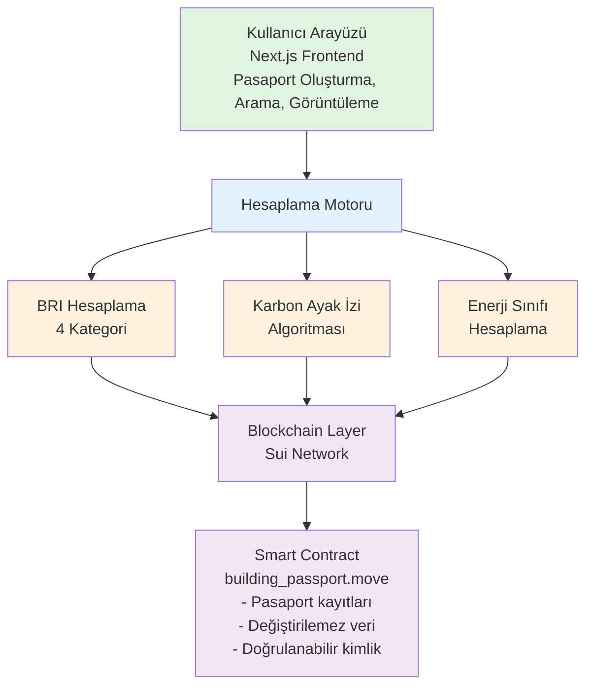
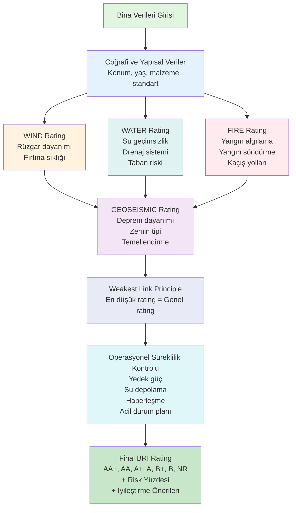
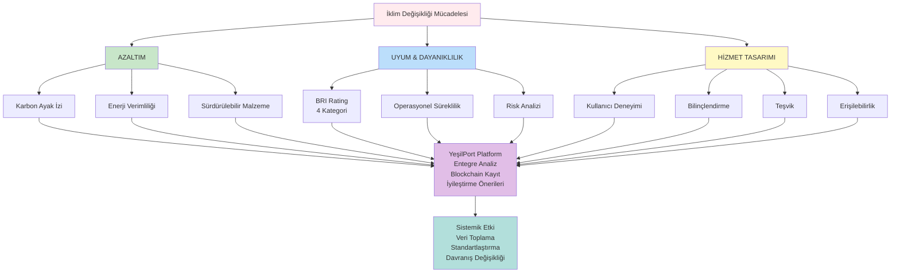
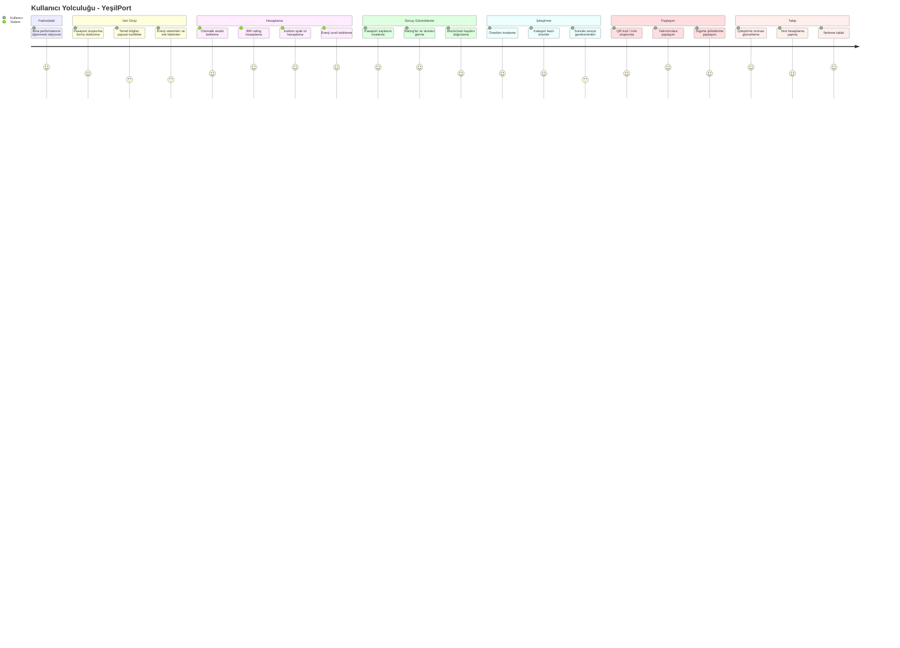
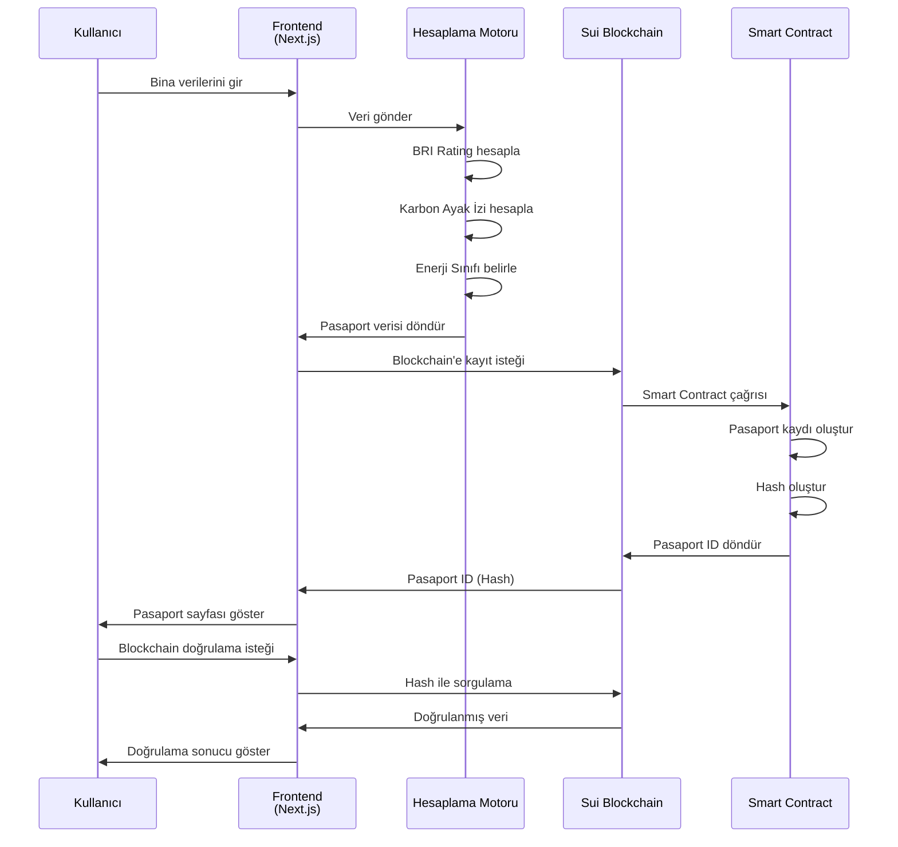
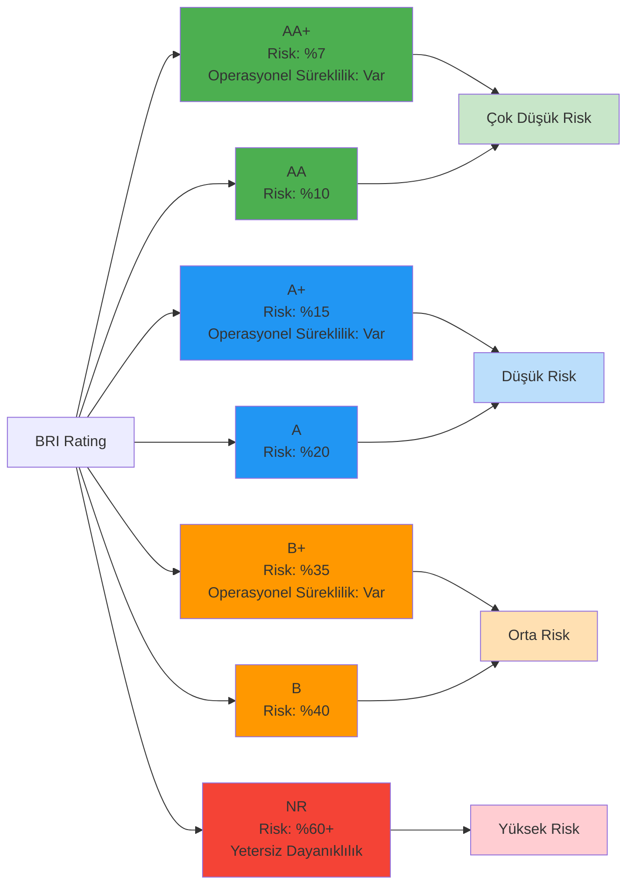
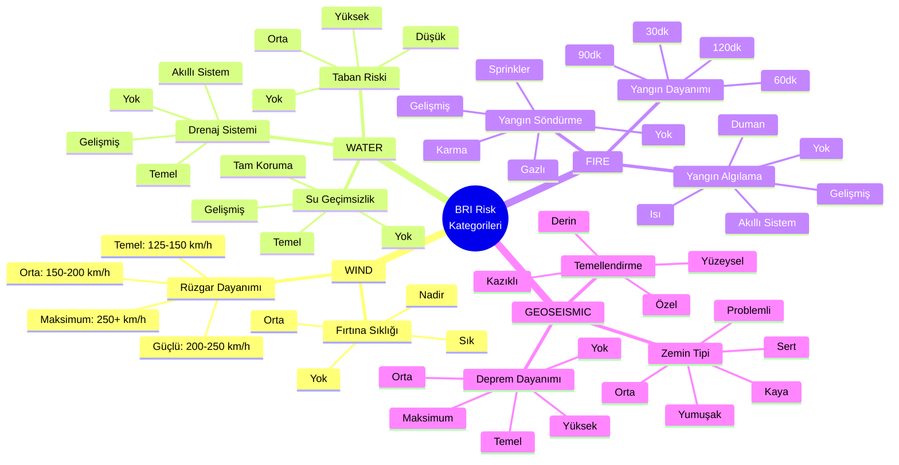
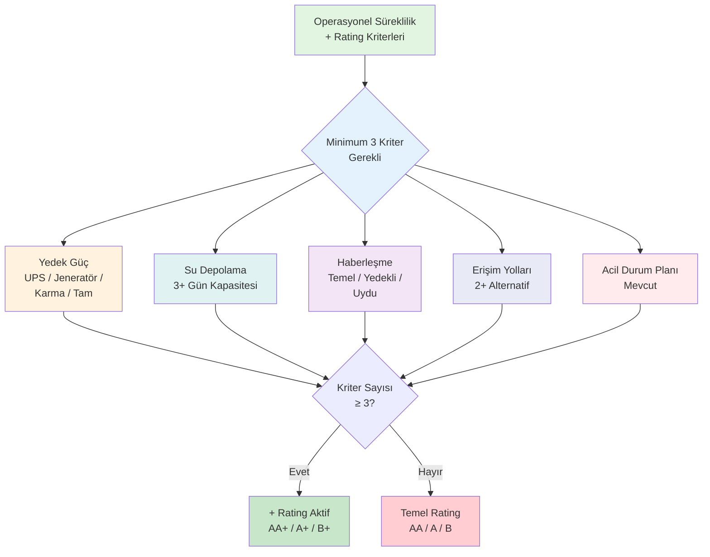
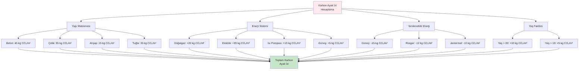
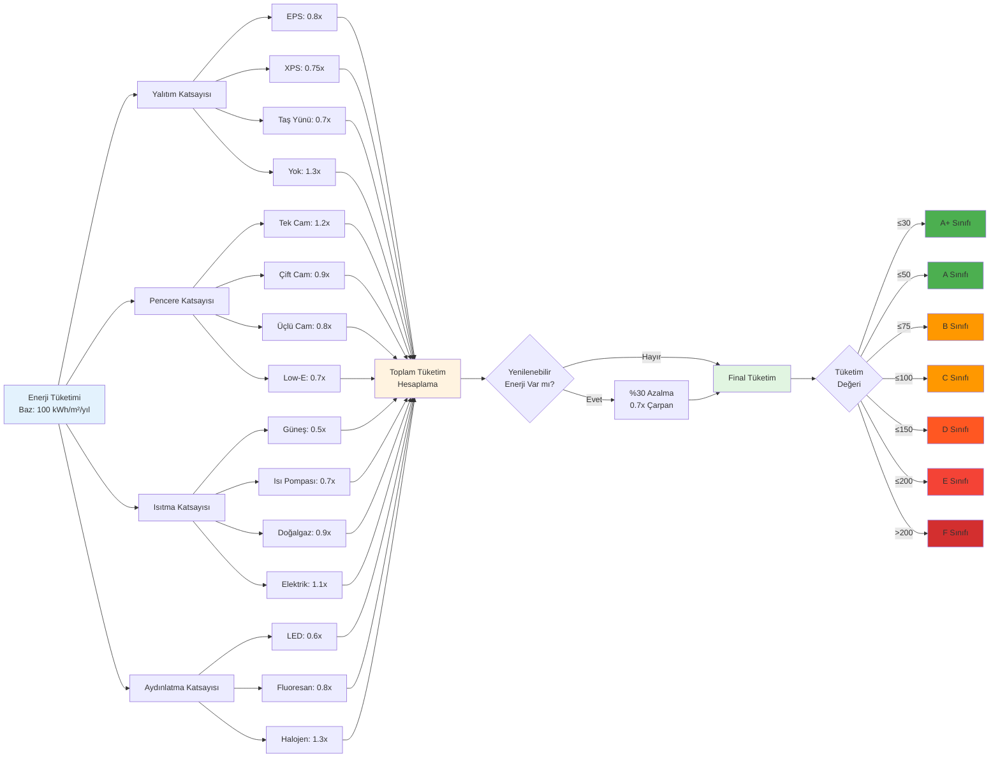

# YeşilPort: İklim Değişikliği ile Mücadele Bağlantısı

## Özet

YeşilPort, dijital bina pasaportu platformu olarak **hem Azaltım (Mitigation) hem de Uyum & Dayanıklılık (Adaptation & Resilience)** yaklaşımlarını entegre eden bir hizmet tasarımı çözümüdür. Proje, binaların iklim değişikliğiyle mücadeledeki rolünü sistematik bir şekilde değerlendirerek, bireyleri ve toplulukları bilinçli karar verme süreçlerine dahil eder.

---

## 1. İklim Değişikliği ile Mücadele Bağlantısı

### 1.1 Azaltım (Mitigation) Bağlantısı

YeşilPort, sera gazı salımlarını azaltmaya yönelik aşağıdaki mekanizmaları içerir:

#### 1.1.1 Karbon Ayak İzi Hesaplama ve İzleme

**Teknik Yaklaşım:**
- Malzeme bazlı karbon emisyon hesaplama (kg CO₂/m²/yıl)
- Enerji tüketimi kaynaklı emisyon takibi
- Yaş faktörü ve yapı standardına göre emisyon katsayıları

**Azaltım Etkisi:**
```
Karbon Emisyon Faktörleri:
- Yapı Malzemesi: Beton (45), Çelik (55), Ahşap (15), Tuğla (35) kg CO₂/m²
- Enerji Sistemi: Doğalgaz (20), Elektrik (35), Isı Pompası (15), Güneş (5) kg CO₂/m²
- Yenilenebilir Enerji Bonusu: Güneş (-15), Rüzgar (-12), Jeotermal (-10) kg CO₂/m²
```

**Davranış Değişikliği:**
- Bina sahipleri ve yöneticileri, karbon ayak izi skorlarını görerek iyileştirme yönünde harekete geçer
- Düşük karbonlu malzeme seçimleri teşvik edilir
- Yenilenebilir enerji yatırımları için veri tabanlı gerekçe sağlanır

#### 1.1.2 Enerji Verimliliği Sınıflandırması

**Metodoloji:**
- EU direktiflerine uygun enerji sınıfı hesaplama (A+ - F)
- Yalıtım, pencere, ısıtma/soğutma ve aydınlatma sistemlerinin entegre değerlendirmesi
- kWh/m²/yıl bazlı tüketim hesaplama

**Azaltım Mekanizması:**
```
Enerji Tüketim Katsayıları:
- Yalıtım: EPS (0.8x), XPS (0.75x), Taş Yünü (0.7x), Yok (1.3x)
- Pencere: Tek Cam (1.2x), Çift Cam (0.9x), Üçlü Cam (0.8x), Low-E (0.7x)
- Isıtma: Güneş (0.5x), Isı Pompası (0.7x), Doğalgaz (0.9x), Elektrik (1.1x)
- Yenilenebilir Enerji: %30 azalma (0.7x çarpan)
```

**Sistemik Etki:**
- Enerji performans sertifikasyonu için veri sağlar
- Yatırım kararlarında enerji verimliliği önceliklendirilir
- Toplu iyileştirme programları için veri toplama aracı görevi görür

#### 1.1.3 Sürdürülebilir Malzeme ve Sistem Seçimleri

**Değerlendirme Kriterleri:**
- Düşük karbonlu malzeme tercihleri (ahşap, geri dönüştürülmüş malzemeler)
- Atık yönetimi sistemleri (ayrıştırılmış, kompost, sıfır atık)
- Su verimliliği sistemleri (yağmur suyu toplama, gri su sistemi)

**Azaltım Bağlantısı:**
- Yaşam döngüsü boyunca emisyon azaltımı
- Döngüsel ekonomi prensiplerine uyum
- Kaynak verimliliği artışı

### 1.2 Uyum & Dayanıklılık (Adaptation & Resilience) Bağlantısı

YeşilPort, Building Resilience Index (BRI) metodolojisi üzerinden iklim değişikliğinin olumsuz etkilerine karşı dayanıklılığı değerlendirir.

#### 1.2.1 Building Resilience Index (BRI) Sistemi

**Metodoloji:**
IFC World Bank Group'un Building Resilience Index metodolojisine dayalı, dört ana risk kategorisinde değerlendirme:

```
BRI Kategorileri:
1. WIND (Rüzgar Riskleri)
2. WATER (Su Riskleri)
3. FIRE (Yangın Riskleri)
4. GEOSEISMIC (Jeolojik Riskler)
```

**Rating Sistemi:**
- **AA+**: Risk %7, Operasyonel süreklilik mevcut
- **AA**: Risk %10
- **A+**: Risk %15, Operasyonel süreklilik mevcut
- **A**: Risk %20
- **B+**: Risk %35, Operasyonel süreklilik mevcut
- **B**: Risk %40
- **NR**: Risk %60+, Yetersiz dayanıklılık

**Weakest Link Principle:**
Genel rating, dört kategoriden en düşük olanına göre belirlenir. Bu yaklaşım, sistemin en zayıf halkasını tespit ederek hedefli iyileştirmeler yapılmasını sağlar.

#### 1.2.2 WIND (Rüzgar) Dayanıklılığı

**Değerlendirme Parametreleri:**
- Rüzgar dayanımı: Temel (125-150 km/h), Orta (150-200 km/h), Güçlü (200-250 km/h), Maksimum (250+ km/h)
- Fırtına sıklığı: Yok, Nadir, Orta, Sık
- Yapı kalitesi ve standardı

**Uyum Mekanizması:**
- İklim değişikliğiyle artan fırtına şiddeti ve sıklığına karşı hazırlık
- Yapısal güçlendirme önerileri
- Risk haritalama ve erken uyarı sistemleri için veri sağlama

#### 1.2.3 WATER (Su) Dayanıklılığı

**Değerlendirme Parametreleri:**
- Su geçimsizlik: Yok, Temel, Gelişmiş, Tam Koruma
- Drenaj sistemi: Yok, Temel, Gelişmiş, Akıllı Sistem
- Taban riski: Yok, Düşük, Orta, Yüksek
- Coğrafi faktörler: Denize/nehre uzaklık, denizden yükseklik

**Uyum Mekanizması:**
- Sel ve taşkın risklerine karşı hazırlık
- Su yönetimi sistemlerinin değerlendirilmesi
- İklim değişikliğiyle artan yağış şiddetine uyum

#### 1.2.4 FIRE (Yangın) Dayanıklılığı

**Değerlendirme Parametreleri:**
- Yangın algılama: Yok, Duman, Isı, Gelişmiş, Akıllı Sistem
- Yangın söndürme: Yok, Sprinkler, Gazlı, Karma, Gelişmiş Sistem
- Yangın dayanımı: 30dk, 60dk, 90dk, 120dk
- Kaçış yolları sayısı
- Orman yangını riski (uzaklık)

**Uyum Mekanizması:**
- Artan sıcaklık ve kuraklıkla birlikte yükselen yangın riskine karşı hazırlık
- Orman yangını riski değerlendirmesi
- Acil durum planlaması

#### 1.2.5 GEOSEISMIC (Jeolojik) Dayanıklılığı

**Değerlendirme Parametreleri:**
- Deprem dayanımı: Yok, Temel, Orta, Yüksek, Maksimum
- Zemin tipi: Kaya, Sert, Orta, Yumuşak, Problemli
- Temellendirme: Yüzeysel, Derin, Kazıklı, Özel
- Deprem bölgesi: 1-5 (Türkiye deprem haritası)
- Heyelan riski: Yok, Düşük, Orta, Yüksek

**Uyum Mekanizması:**
- Deprem riskine karşı yapısal dayanıklılık değerlendirmesi
- Zemin koşullarına göre uygun temellendirme önerileri
- Heyelan riski değerlendirmesi

#### 1.2.6 Operasyonel Süreklilik

**+ Rating Kriterleri:**
Operasyonel süreklilik önlemleri, BRI rating'ine "+" eklenmesini sağlar:

- Yedek güç: UPS, Jeneratör, Karma Sistem, Tam Yedekleme
- Su depolama: 3+ gün kapasitesi
- Haberleşme: Temel, Yedekli, Uydu Bağlantısı
- Erişim yolları: 2+ alternatif erişim
- Acil durum planı: Mevcut

**Uyum Mekanizması:**
- İklim değişikliği kaynaklı aşırı hava olaylarında operasyonel süreklilik
- Altyapı kesintilerine karşı dayanıklılık
- Toplumsal hizmetlerin kesintisiz devamı

---

## 2. Hizmet Tasarımı Perspektifi

### 2.1 Kullanıcı Deneyimi ve İhtiyaç Analizi

**Hedef Kitle:**
1. **Bina Sahipleri ve Yöneticileri:** Binalarının performansını anlamak ve iyileştirmek isteyenler
2. **Yatırımcılar:** Sürdürülebilirlik kriterlerine göre değerlendirme yapanlar
3. **Yerel Yönetimler:** Toplu iyileştirme programları için veri toplama
4. **Sigorta Şirketleri:** Risk değerlendirmesi için veri kaynağı
5. **Topluluklar:** Mahalle/bölge bazlı dayanıklılık planlaması

**Problem Tanımı:**
- Bina performans verilerinin dağınık ve erişilemez olması
- Sürdürülebilirlik ve dayanıklılık değerlendirmelerinin subjektif olması
- İyileştirme kararlarında veri eksikliği
- İklim değişikliği risklerinin yapı bazında değerlendirilmemesi

**Çözüm Yaklaşımı:**
- Standartlaştırılmış değerlendirme metodolojisi
- Blockchain tabanlı güvenilir veri saklama
- Kullanıcı dostu görselleştirme ve raporlama
- İyileştirme önerileri ve yol haritası

### 2.2 Davranış Değişikliği Mekanizmaları

#### 2.2.1 Bilinçlendirme ve Farkındalık

**Mekanizma:**
- Görsel skorlar ve rating'ler (BRI, Enerji Sınıfı, Karbon Ayak İzi)
- Karşılaştırmalı analiz imkanı
- Risk yüzdesi ve kategorik değerlendirmeler

**Etki:**
- Bina sahipleri, binalarının gerçek performansını görür
- İyileştirme ihtiyacı somut verilerle desteklenir
- Toplumsal farkındalık artar

#### 2.2.2 Teşvik ve Ödüllendirme

**Mekanizma:**
- Yüksek BRI rating'leri için görsel rozetler
- İyileştirme önerileri ve sonraki seviye gereksinimleri
- Blockchain'de kalıcı ve doğrulanabilir kayıt

**Etki:**
- Rekabetçi bir ortam yaratır (binalar arası karşılaştırma)
- İyileştirme yatırımları için gerekçe sağlar
- Sertifikasyon ve tanınma imkanı

#### 2.2.3 Erişilebilirlik ve Kapsayıcılık

**Tasarım Prensipleri:**
- Basit ve anlaşılır arayüz
- Mobil uyumlu tasarım
- Çoklu dil desteği (gelecek özellik)
- Ücretsiz temel değerlendirme

**Etki:**
- Farklı sosyo-ekonomik gruplara erişim
- Teknik bilgi gerektirmeden kullanım
- Toplumsal katılımı artırma

### 2.3 Sistemik Dönüşüm Potansiyeli

#### 2.3.1 Veri Toplama ve Analiz

**Sistemik Etki:**
- Şehir/bölge bazlı performans haritaları
- Trend analizi ve iyileştirme takibi
- Politika geliştirme için veri kaynağı

#### 2.3.2 Standartlaştırma

**Sistemik Etki:**
- Ulusal/uluslararası standartlara uyum (BRI, EU Enerji Direktifleri)
- Karşılaştırılabilir veri setleri
- Sertifikasyon sistemleri için altyapı

#### 2.3.3 Blockchain Güvencesi

**Sistemik Etki:**
- Değiştirilemez ve doğrulanabilir kayıtlar
- Güven ve şeffaflık
- Sigorta ve finansman için veri kaynağı

---

## 3. Teknik Mimari ve Uygulanabilirlik

### 3.1 Teknik Altyapı

**Frontend:**
- Next.js 14 (React 18)
- TypeScript (tip güvenliği)
- Tailwind CSS (responsive tasarım)

**Hesaplama Motoru:**
- BRI metodolojisi implementasyonu
- Karbon ayak izi algoritmaları
- Enerji verimliliği hesaplamaları

**Blockchain Entegrasyonu:**
- Sui Network (yüksek throughput, düşük maliyet)
- Smart contract'lar (pasaport kayıtları)
- Değiştirilemez veri saklama

### 3.2 Uygulanabilirlik Planı

**Faz 1: MVP (Mevcut Durum)**
- Temel pasaport oluşturma
- BRI hesaplama
- Karbon ayak izi ve enerji sınıfı hesaplama
- Blockchain entegrasyonu (Sui testnet)

**Faz 2: Genişletilmiş Özellikler**
- QR kod ile pasaport paylaşımı
- Mobil uygulama
- API entegrasyonları (enerji tüketim verileri)
- Çoklu dil desteği

**Faz 3: Toplumsal Ölçek**
- Yerel yönetim entegrasyonları
- Toplu veri analizi ve raporlama
- İyileştirme programları yönetimi
- Finansman ve sigorta entegrasyonları

---

## 4. Diyagramlar

### 4.1 Sistem Mimarisi



### 4.2 BRI Hesaplama Akışı



### 4.3 Azaltım ve Uyum Entegrasyonu



### 4.4 Kullanıcı Yolculuğu (User Journey)



### 4.5 Veri Akışı ve Blockchain Entegrasyonu



### 4.6 BRI Rating Sistemi ve Risk Seviyeleri



### 4.7 Risk Değerlendirme Kategorileri



### 4.8 Operasyonel Süreklilik Kriterleri



### 4.9 Karbon Ayak İzi Hesaplama Faktörleri



### 4.10 Enerji Verimliliği Hesaplama Sistemi



---

## 5. Sonuç ve Etki Değerlendirmesi

### 5.1 İklim Değişikliği ile Mücadele Katkısı

**Azaltım (Mitigation):**
- Karbon ayak izi hesaplama ve izleme ile emisyon farkındalığı
- Enerji verimliliği sınıflandırması ile tüketim azaltımı
- Sürdürülebilir malzeme seçimlerinin teşviki
- Yenilenebilir enerji yatırımları için veri tabanlı gerekçe

**Uyum & Dayanıklılık (Adaptation & Resilience):**
- BRI metodolojisi ile sistematik risk değerlendirmesi
- İklim değişikliği kaynaklı aşırı hava olaylarına hazırlık
- Yapısal dayanıklılık ve operasyonel süreklilik değerlendirmesi
- Toplumsal düzeyde dayanıklılık planlaması için veri kaynağı

### 5.2 Hizmet Tasarımı Kriterlerine Uyum

**Bireyleri ve Toplulukları Güçlendirme:**
- Bilinçli karar verme için veri sağlama
- Erişilebilir ve kullanıcı dostu arayüz
- Toplumsal katılımı artırma

**Davranış Değişikliği:**
- Görsel skorlar ve rating'ler ile farkındalık
- İyileştirme önerileri ile harekete geçirme
- Rekabetçi ortam yaratma (binalar arası karşılaştırma)

**Sistemik Dönüşüm:**
- Standartlaştırılmış değerlendirme metodolojisi
- Blockchain ile güvenilir veri saklama
- Toplu veri analizi ve politika geliştirme için altyapı

**Uzun Vadeli Etki:**
- Sürdürülebilir yaşam alışkanlıklarının yaygınlaştırılması
- İklim dostu dönüşümün bir parçası olma
- Toplumsal düzeyde uzun vadeli etki yaratma

### 5.3 Uygulanabilirlik ve Gerçekçilik

**Teknik Uygulanabilirlik:**
- Mevcut teknolojilerle geliştirilebilir (Next.js, Sui)
- Ölçeklenebilir mimari
- Blockchain entegrasyonu ile güvenilirlik

**Ekonomik Uygulanabilirlik:**
- Düşük işletme maliyetleri (blockchain, cloud hosting)
- Ölçek ekonomisi (çok sayıda bina için maliyet düşüşü)
- Finansman modelleri (yerel yönetim, sigorta, yatırımcı desteği)

**Sosyal Uygulanabilirlik:**
- Kullanıcı dostu arayüz
- Erişilebilir tasarım
- Toplumsal katılımı teşvik eden özellikler

---

## 6. Referanslar ve Metodoloji

### 6.1 Kullanılan Metodolojiler

1. **Building Resilience Index (BRI)**
   - IFC World Bank Group metodolojisi
   - Weakest Link Principle
   - Risk yüzdesi hesaplama (Table 2)

2. **Enerji Verimliliği Sınıflandırması**
   - EU Energy Performance of Buildings Directive
   - kWh/m²/yıl bazlı hesaplama

3. **Karbon Ayak İzi Hesaplama**
   - Malzeme bazlı emisyon faktörleri
   - Enerji tüketimi kaynaklı emisyonlar
   - Yaşam döngüsü değerlendirmesi

### 6.2 Blockchain Teknolojisi

- **Sui Network:** Yüksek throughput, düşük maliyet, hızlı finality
- **Smart Contract:** Move programlama dili
- **Değiştirilemez Kayıt:** Pasaport verilerinin güvenilir saklanması

---

**Dokümantasyon Tarihi:** 2025  
**Proje:** YeşilPort - Dijital Bina Pasaportu  
**Yarışma:** Sürdürülebilir Geleceği Tasarla 2025  
**Kategori:** Hizmet Tasarımı

