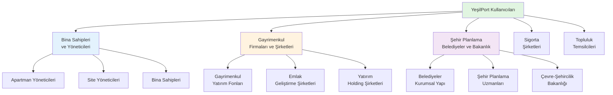
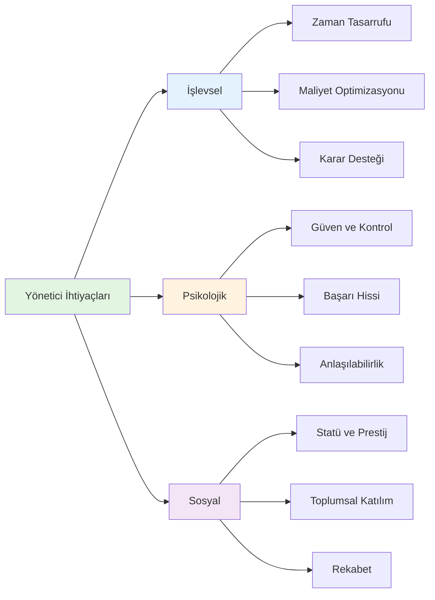
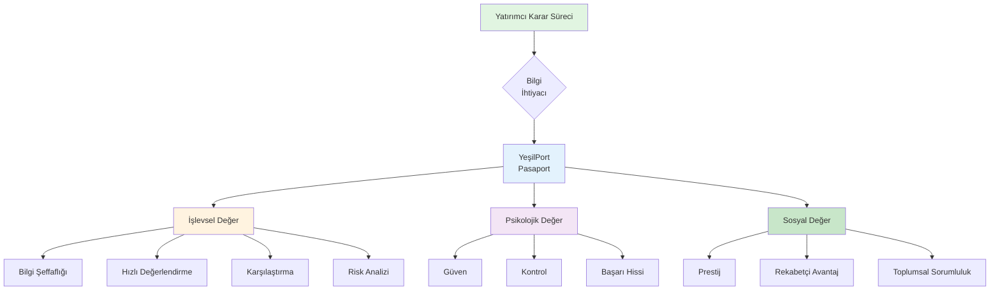
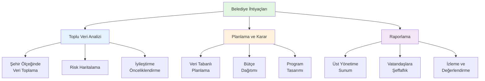

# YeşilPort: Kullanıcı Profilleri ve Değer Analizi

## Giriş

YeşilPort projesi üzerinde çalışırken, tasarımımızın gerçek hayatta nasıl bir etki yaratacağını düşünmek gerekiyor. Bu doküman kapsamında, platformumuzun dokunduğu insanları ve onlara nasıl değer sunduğumuzu analiz edeceğiz. Eğitimde öğrendiğimiz gibi, insanları sadece rasyonel karar veren varlıklar olarak değil, kültürel, psikolojik ve sosyal ihtiyaçları olan bireyler olarak ele alıyoruz.

---

## 1. Tasarımın Başarısını En Çok Etkileyecek İnsanlar

YeşilPort, dijital bina pasaportu platformu olarak birçok farklı paydaşla etkileşime giriyor. Projeyi düşündüğümüzde, başarısını en çok etkileyecek insanları şu şekilde kategorize edebiliriz:

Bu dokümanda, en kritik üç profili derinlemesine inceleyeceğiz:

1. **Apartman/Site Yöneticileri** - Platformun birincil kullanıcıları
2. **Gayrimenkul Firmaları ve Yatırım Şirketleri** - Karar vericiler ve finansal güç
3. **Şehir Planlama Uzmanları, Belediyeler ve Çevre-Şehircilik Bakanlığı** - Sistemik etki yaratabilecek kurumsal yapılar

---

## 2. Profil Analizleri

### 2.1 Profil 1: Apartman/Site Yöneticileri

#### Kimler?

Apartman veya site yöneticileri, YeşilPort'un en doğrudan kullanıcıları. Bu kişiler, binaların günlük işleyişinden sorumlu, sakinlerle sürekli iletişim halinde olan ve bina performansı hakkında kararlar alan kişiler.

#### Nasıl Canlanıyorlar?

**Yaş ve Deneyim:**
- Genellikle 35-60 yaş aralığında
- Çoğunlukla emekli olmuş veya yarı zamanlı çalışan kişiler
- Bina yönetimi konusunda 5-15 yıl arası deneyime sahipler
- Teknik bilgileri sınırlı ama pratik deneyimleri yüksek

**Kültürel ve Sosyal Özellikler:**
- Türkiye'nin farklı bölgelerinden geliyorlar ama çoğunlukla şehirli kültüre sahipler
- Geleneksel değerlerle modern ihtiyaçlar arasında denge kurmaya çalışıyorlar
- Toplumsal sorumluluk duyguları güçlü - "bizim bina" diye düşünüyorlar
- Sakinlerle yakın ilişkiler kuruyorlar, mahalle kültürünün bir parçası

**Teknoloji ve Medya Alışkanlıkları:**
- WhatsApp ve telefon aramaları birincil iletişim araçları
- Facebook ve Instagram kullanıyorlar ama pasif kullanıcılar
- Mobil uygulamalara aşinaları var ama karmaşık sistemlerden kaçınıyorlar
- Excel ve basit formlar kullanıyorlar (aylık gider hesaplamaları için)
- Blockchain, karbon ayak izi gibi kavramlar onlar için yeni ve karmaşık

**Değerler ve Motivasyonlar:**
- Güvenilirlik ve şeffaflık çok önemli
- "İşimi doğru yapıyorum" hissi onlar için kritik
- Sakinlerin memnuniyeti ön planda
- Bütçe yönetimi ve tasarruf konularında hassaslar
- Çevre konularına ilgili ama öncelikleri farklı (maliyet > çevre)

**Tasarıma Dair Fikirleri:**
- Basit ve anlaşılır olmalı - "teknik jargon" istemiyorlar
- Hızlı sonuç almak istiyorlar - uzun formlar doldurmak istemiyorlar
- Görsel ve somut çıktılar tercih ediyorlar (skorlar, renkli göstergeler)
- "Bu benim işime yarayacak mı?" sorusu sürekli kafalarında

#### Problemleri ve İhtiyaçları

**İşlevsel İhtiyaçlar:**
- Bina performansını hızlıca değerlendirebilmek
- Sakinlere rapor sunabilmek (özellikle yönetim kurulu toplantılarında)
- Enerji maliyetlerini azaltmak için somut öneriler almak
- Bina bakım planlaması yapabilmek
- Yasal gereklilikleri yerine getirebilmek (enerji kimlik belgesi gibi)

**Psikolojik İhtiyaçlar:**
- "Ben iyi bir yöneticiyim" hissini yaşamak
- Sakinlerin gözünde güvenilir görünmek
- Karmaşık konuları anlayabilmek ve açıklayabilmek
- Gelecek kaygısı: "Bina eskidikçe ne olacak?" sorusu

**Sosyal İhtiyaçlar:**
- Toplumsal saygı görmek
- "Bizim bina çevre dostu" diyebilmek
- Komşu binalarla karşılaştırma yapabilmek
- Yönetim kurulunda başarılı görünmek

#### Tasarımın Sunduğu Değerler

**İşlevsel Değer:**
- **Zaman Tasarrufu:** Manuel hesaplamalar yerine otomatik analiz. Örneğin, enerji sınıfı hesaplaması için saatlerce uğraşmak yerine 10 dakikada sonuç almak.
- **Maliyet Optimizasyonu:** İyileştirme önerileri sayesinde hangi yatırımın ne kadar tasarruf sağlayacağını görmek. "Bu yalıtım yatırımı 3 yılda kendini amorti edecek" gibi somut bilgiler.
- **Karar Desteği:** Yönetim kurulu toplantılarında "BRI rating'imiz B, şu iyileştirmelerle A'ya çıkarabiliriz" gibi veri tabanlı sunumlar yapabilmek.

**Psikolojik Değer:**
- **Güven ve Kontrol:** Blockchain üzerinde saklanan veriler sayesinde "Bu veriler güvenli ve değiştirilemez" hissi. Özellikle eski binalar için "Binanın durumu ne?" kaygısını azaltmak.
- **Başarı Hissi:** Yüksek BRI rating'i veya iyileştirme sonrası skor artışı görmek, "Ben bu binayı iyi yönetiyorum" duygusu yaratıyor.
- **Anlaşılabilirlik:** Karmaşık teknik terimler yerine görsel skorlar (AA, A, B gibi) ve renkli göstergeler, "Ben bunu anlıyorum" hissi veriyor.

**Sosyal Değer:**
- **Statü ve Prestij:** "Bizim bina AA rating'li" diyebilmek, yönetici olarak saygı görmek. Özellikle çevre bilinci artan toplumda bu önemli.
- **Toplumsal Katılım:** "Biz de sürdürülebilirliğe katkı sağlıyoruz" hissi. İklim değişikliği konusunda farkındalık artıyor ve insanlar bu konuda bir şeyler yapmak istiyor.
- **Rekabet ve Karşılaştırma:** Komşu binalarla karşılaştırma yapabilmek. "Bizim bina mahalledeki en iyi rating'e sahip" gibi gurur duyulacak durumlar.

---

### 2.2 Profil 2: Gayrimenkul Firmaları ve Yatırım Şirketleri

#### Kimler?

Gayrimenkul firmaları, yatırım şirketleri ve emlak geliştirme şirketleri, binaları satın alan, satan, geliştiren veya yatırım amaçlı değerlendiren kurumsal yapılar. Bunlar hem küçük ölçekli emlak şirketleri hem de büyük yatırım fonları ve holding şirketleri olabilir. YeşilPort için kritik çünkü onlar karar vericiler ve finansal güce sahipler. Bu firmalar, portföylerindeki binaları yönetirken ve yeni yatırımlar yaparken veri tabanlı kararlar almak zorundalar.

#### Nasıl Canlanıyorlar?

**Kurumsal Yapı ve Ölçek:**
- Küçük ölçekli emlak şirketleri (5-20 çalışan) ve büyük holding şirketleri (100+ çalışan) arasında geniş bir yelpaze
- Portföy yönetimi ekipleri, yatırım analistleri, emlak geliştirme uzmanları gibi profesyonellerden oluşuyorlar
- Çoğunlukla finans, işletme, mühendislik veya mimarlık geçmişine sahip profesyoneller çalışıyor
- Kurumsal karar alma süreçleri var - bireysel değil, ekip bazlı kararlar alınıyor
- ESG (Environmental, Social, Governance) kriterleri giderek önemli hale geliyor, özellikle büyük şirketler için

**Kurumsal Kültür ve Değerler:**
- Şehirli, modern iş kültürüne sahipler
- Global trendleri takip ediyorlar - uluslararası standartlara uyum önemli
- Profesyonel networking önemli - sektör etkinlikleri, konferanslar
- "Akıllı yatırım" yapmak istiyorlar - sadece kısa vadeli kâr değil, uzun vadeli değer de önemli
- Kurumsal sosyal sorumluluk (CSR) programları var, çevre bilinci artıyor
- Rekabetçi piyasada fark yaratmak için veri tabanlı kararlar almak zorundalar

**Teknoloji ve Sistem Alışkanlıkları:**
- Kurumsal yazılımlar kullanıyorlar - CRM sistemleri, portföy yönetim araçları
- Veri analizi araçlarına aşinalar (Excel, Power BI, Tableau gibi)
- Web tabanlı platformlar tercih ediyorlar - masaüstü ve mobil erişim önemli
- Blockchain ve yeni teknolojilere ilgili ama şüpheci yaklaşıyorlar ("gerçekten güvenilir mi?")
- API entegrasyonları önemli - mevcut sistemlerle uyumlu olmalı
- Hızlı karar vermek için hızlı bilgi erişimi kritik

**Kurumsal Değerler ve Motivasyonlar:**
- **Risk Yönetimi:** Yatırım yaparken riskleri minimize etmek, portföy çeşitlendirmesi
- **Şeffaflık:** Satın alacakları binanın gerçek durumunu bilmek, yatırımcılara rapor sunmak
- **Rekabetçilik:** Diğer firmalardan önce iyi fırsatları yakalamak, piyasada avantaj sağlamak
- **Sürdürülebilirlik:** Uzun vadeli değer yaratmak, ESG kriterlerine uyum, kurumsal itibar
- **Veri Odaklılık:** Duygusal kararlar yerine veri tabanlı kararlar vermek, yatırımcılara güven vermek
- **Ölçeklenebilirlik:** Çok sayıda binayı yönetirken verimli sistemler kullanmak

**Tasarıma Dair Fikirleri:**
- Profesyonel görünmeli - "bu ciddi bir platform, kurumsal kullanıma uygun"
- Hızlı ve verimli olmalı - "zamanımız değerli, çok sayıda bina yönetiyoruz"
- Karşılaştırma yapabilmeli - "portföyümüzdeki binaları karşılaştırabilmeliyiz"
- Güvenilir olmalı - "bu verilere güvenebilir miyiz? Yatırımcılarımıza sunabilir miyiz?"
- Blockchain entegrasyonu onlar için artı değer - "değiştirilemez kayıt" güven veriyor
- API entegrasyonu önemli - "mevcut sistemlerimizle entegre olabilmeli"

#### Problemleri ve İhtiyaçları

**İşlevsel İhtiyaçlar:**
- **Bilgi Asimetrisi:** Satın alırken binanın gerçek durumunu bilmek. "Bu bina depreme dayanıklı mı?", "Enerji maliyetleri ne kadar?", "Bakım giderleri yüksek mi?" gibi sorular. Portföy yönetimi için kritik.
- **Portföy Yönetimi:** Çok sayıda binayı yönetirken toplu analiz yapabilmek. "Portföyümüzdeki binaların ortalama BRI rating'i ne?", "Hangi binalar iyileştirme gerektiriyor?"
- **Karşılaştırma:** Farklı binaları karşılaştırabilmek. "Bu bina mahalledeki diğer binalardan daha mı iyi?", "Portföyümüzdeki en iyi bina hangisi?"
- **Risk Değerlendirmesi:** Yatırım riskini ölçebilmek. "Bu bina gelecekte değer kaybeder mi?", "İyileştirme maliyetleri ne kadar?", "Portföy riskimiz ne seviyede?"
- **Raporlama:** Yatırımcılara ve üst yönetime rapor sunabilmek. "Portföyümüzün sürdürülebilirlik performansı nasıl?", "ESG kriterlerine uyumumuz ne seviyede?"
- **Hızlı Karar:** Zamanında karar verebilmek için hızlı bilgi erişimi. Çok sayıda bina için ölçeklenebilir sistem.

**Kurumsal Psikolojik İhtiyaçlar:**
- **Güven:** Yatırım yaparken "doğru karar veriyoruz" hissi. Özellikle büyük yatırımlarda ve yatırımcılara rapor sunarken kaygı yüksek.
- **Kontrol:** Portföydeki binaların durumunu kontrol edebilmek, "her şeyi biliyoruz" hissi.
- **Başarı:** İyi yatırımlar yapmak, "akıllı bir şirketiz" hissi. Ekip motivasyonu için önemli.

**Kurumsal Sosyal İhtiyaçlar:**
- **Kurumsal İtibar:** "Biz sürdürülebilir yatırımlar yapıyoruz" diyebilmek. Özellikle ESG trendi artıyor ve yatırımcılar bunu önemsiyor.
- **Rekabet:** Diğer firmalardan önce iyi fırsatları yakalamak, piyasada avantaj sağlamak.
- **Kurumsal Sosyal Sorumluluk:** "Biz de çevreye katkı sağlıyoruz" hissi. CSR programları için veri sağlamak.
- **Yatırımcı İlişkileri:** Yatırımcılara "sürdürülebilir portföy yönetiyoruz" mesajını vermek.

#### Tasarımın Sunduğu Değerler

**İşlevsel Değer:**
- **Bilgi Şeffaflığı:** Blockchain üzerinde saklanan, değiştirilemez veriler sayesinde binanın gerçek durumunu görmek. "Bu veriler güvenilir mi?" sorusunu ortadan kaldırmak. Yatırımcılara rapor sunarken kritik.
- **Hızlı Değerlendirme:** Pasaport ID'si ile birkaç saniyede binanın tüm performans verilerine ulaşmak. Emlak görüşmelerinde "Hemen kontrol edeyim" diyebilmek. Çok sayıda bina için ölçeklenebilir.
- **Portföy Analizi:** Portföydeki tüm binaların BRI rating'lerini, enerji sınıflarını, karbon ayak izlerini toplu olarak analiz edebilmek. "Portföyümüzün ortalama performansı ne?" gibi sorulara cevap vermek.
- **Karşılaştırma Aracı:** Farklı binaları karşılaştırabilmek. "Bu bina mahalledeki en iyi rating'e sahip", "Portföyümüzdeki en iyi bina hangisi?" gibi objektif karşılaştırmalar.
- **Risk Analizi:** BRI rating'i sayesinde yatırım riskini ölçebilmek. "AA rating'li bina = düşük risk" gibi net korelasyonlar. Portföy risk yönetimi için kritik.
- **Raporlama:** Yatırımcılara ve üst yönetime sunum yapabilmek. "Portföyümüzün sürdürülebilirlik performansı", "ESG kriterlerine uyumumuz" gibi raporlar.

**Kurumsal Psikolojik Değer:**
- **Güven ve Huzur:** Blockchain kayıtları sayesinde "Bu veriler manipüle edilemez" hissi. Özellikle büyük yatırımlarda ve yatırımcılara rapor sunarken kritik.
- **Kontrol Hissi:** Portföydeki tüm binaların özelliklerini tek bir yerde görmek, "Her şeyi biliyoruz, kontrol bizde" hissi.
- **Başarı ve Profesyonellik:** Veri tabanlı karar vermek, "Biz akıllı bir şirketiz, verilerle karar veriyoruz" hissi. Ekip motivasyonu için önemli.

**Kurumsal Sosyal Değer:**
- **Kurumsal İtibar ve Prestij:** "Biz sürdürülebilir yatırımlar yapıyoruz" diyebilmek. ESG kriterleri giderek önemli hale geliyor ve yatırımcılar bunu önemsiyor.
- **Rekabetçi Avantaj:** Diğer firmalardan önce bilgiye ulaşmak, "Biz daha hızlı karar verebiliyoruz" avantajı. Piyasada fark yaratmak.
- **Kurumsal Sosyal Sorumluluk:** "Biz de iklim değişikliğiyle mücadeleye katkı sağlıyoruz" hissi. CSR programları için veri sağlamak.
- **Yatırımcı İlişkileri:** Yatırımcılara "sürdürülebilir portföy yönetiyoruz" mesajını vermek. ESG yatırımcıları için önemli.

---

### 2.3 Profil 3: Şehir Planlama Uzmanları, Belediyeler ve Çevre-Şehircilik Bakanlığı

#### Kimler?

Bu profil, sadece bireysel çalışanlar değil, aynı zamanda kurumsal yapıları da içeriyor. Şehir planlama uzmanları (mimar, şehir plancısı, çevre mühendisi gibi profesyoneller), belediyeler (kurumsal yapı olarak) ve Çevre, Şehircilik ve İklim Değişikliği Bakanlığı. Bunlar YeşilPort'un sistemik etki yaratabileceği kullanıcılar. Toplu veri analizi yaparak şehir, bölge ve ülke ölçeğinde kararlar alabilirler. Sadece bireysel ihtiyaçlar değil, kurumsal ihtiyaçlar ve politika geliştirme süreçleri de önemli.

#### Nasıl Canlanıyorlar?

**Kurumsal Yapı ve Hiyerarşi:**
- **Belediyeler (Kurumsal):** Farklı büyüklüklerde - küçük belediyeler (10-50 çalışan) ve büyük metropol belediyeleri (1000+ çalışan)
- **Çevre-Şehircilik Bakanlığı:** Merkezi yönetim, politika geliştirme, ulusal ölçekte kararlar
- **Şehir Planlama Uzmanları:** Hem belediyelerde hem bakanlıkta hem de özel sektörde çalışan profesyoneller
- Geniş bir yaş aralığı: 25-60 yaş arası çalışanlar
- Çoğunlukla mühendis, mimar, şehir plancısı veya çevre mühendisi geçmişine sahipler
- Kamu sektöründe çalışıyorlar, bürokratik süreçlere aşinalar
- Veri toplama ve analiz konularında deneyimliler ama modern araçlar kullanmakta zorlanabiliyorlar
- "Şehir/ülke için en iyisini yapmak" motivasyonu güçlü

**Kurumsal Kültür ve Değerler:**
- Toplumsal sorumluluk duyguları çok güçlü - "halka hizmet" anlayışı
- Sürdürülebilirlik konularına ilgili ama bütçe kısıtları var
- Farklı şehirlerden, farklı kültürel geçmişlere sahipler
- "Bizim şehrimiz/ülkemiz" diye düşünüyorlar, aidiyet duygusu güçlü
- Politik baskılar altında çalışıyorlar, "doğru karar vermek" zorunda
- Kurumsal hiyerarşi önemli - üst yönetime rapor sunmak gerekiyor
- Ulusal politikalara uyum sağlamak zorundalar

**Teknoloji ve Sistem Alışkanlıkları:**
- Excel, GIS (Coğrafi Bilgi Sistemleri) gibi araçlara aşinalar
- Web tabanlı sistemler kullanıyorlar ama karmaşık sistemlerden kaçınıyorlar
- Raporlama ve sunum yapıyorlar - görselleştirme önemli
- Blockchain gibi yeni teknolojilere ilgili ama şüpheci yaklaşıyorlar ("gerçekten güvenilir mi?")
- Mobil uygulamalar kullanıyorlar ama masaüstü tercih ediyorlar
- Mevcut kamu sistemleriyle entegrasyon önemli
- API entegrasyonları gerekebilir

**Kurumsal Değerler ve Motivasyonlar:**
- **Toplumsal Fayda:** "Şehrimiz/ülkemiz için en iyisini yapmak" öncelikli
- **Veri Odaklı Karar:** Duygusal değil, veri tabanlı kararlar vermek istiyorlar
- **Şeffaflık:** Vatandaşlara karşı şeffaf olmak, "ne yaptığımızı göstermek"
- **Sürdürülebilirlik:** Uzun vadeli planlama, gelecek nesilleri düşünmek
- **Etkinlik:** Sınırlı kaynaklarla maksimum etki yaratmak
- **Politika Geliştirme:** Ulusal ve yerel politika geliştirme süreçlerine veri sağlamak
- **Uyum:** Ulusal standartlara ve mevzuata uyum sağlamak

**Tasarıma Dair Fikirleri:**
- Toplu veri analizi yapabilmeli - "şehrimizdeki/ülkemizdeki binaların durumu ne?"
- Raporlama ve sunum için uygun olmalı - "belediye meclisine/bakanlığa sunabilir miyiz?"
- Güvenilir olmalı - "bu verilere güvenebilir miyiz? Vatandaşlara sunabilir miyiz?"
- Erişilebilir olmalı - "vatandaşlar da görebilmeli"
- Entegre olabilmeli - "mevcut sistemlerimizle uyumlu mu?"
- Ölçeklenebilir olmalı - "şehir ölçeğinden ülke ölçeğine kadar çalışabilmeli"

#### Problemleri ve İhtiyaçları

**İşlevsel İhtiyaçlar:**
- **Veri Toplama:** Şehir, bölge veya ülke ölçeğinde binaların durumunu toplu olarak görmek. "Hangi bölgelerde risk var?", "Hangi binalar iyileştirme gerektiriyor?", "Ülke genelinde durum nasıl?"
- **Planlama:** İyileştirme programları planlamak. "Hangi bölgelere öncelik vermeliyiz?", "Bütçe nasıl dağıtılmalı?", "Ulusal politika nasıl olmalı?"
- **Politika Geliştirme:** Ulusal ve yerel politika geliştirme süreçlerine veri sağlamak. "Hangi bölgelerde destek programları gerekli?", "Mevzuat değişiklikleri için veri var mı?"
- **Raporlama:** Üst yönetime, meclise, bakanlığa ve vatandaşlara rapor sunmak. "Şehrimizdeki/ülkemizdeki binaların %X'i A sınıfı enerji verimliliğine sahip" gibi.
- **İzleme:** İyileştirme programlarının etkisini ölçmek. "Bu program başarılı mı?", "Hedeflerimize ulaştık mı?", "Ulusal hedeflere ne kadar yakınız?"
- **Haritalama:** Coğrafi olarak risk haritaları oluşturmak. "Hangi mahallelerde/illerde yüksek risk var?"

**Kurumsal Psikolojik İhtiyaçlar:**
- **Başarı Hissi:** "Biz şehrimiz/ülkemiz için iyi işler yapıyoruz" hissi. Özellikle zorlu bürokratik süreçlerde motivasyon önemli.
- **Güven:** "Bu verilere güvenebiliriz, doğru kararlar veriyoruz" hissi. Vatandaşlara sunarken kritik.
- **Anlaşılabilirlik:** Karmaşık verileri basit şekilde sunabilmek, "herkes anlayabilsin" isteği. Hem üst yönetim hem vatandaşlar için.

**Kurumsal Sosyal İhtiyaçlar:**
- **Toplumsal Tanınma:** "Biz sürdürülebilir bir şehir/ülke yaratıyoruz" diyebilmek.
- **Şeffaflık:** Vatandaşlara karşı şeffaf olmak, "ne yaptığımızı gösteriyoruz" hissi. Demokratik süreçler için önemli.
- **Rekabet ve Prestij:** Diğer şehirlerle/ülkelerle karşılaştırma yapabilmek. "Bizim şehrimiz/ülkemiz en sürdürülebilir" gibi.
- **Politik Başarı:** "Biz doğru politikaları uyguluyoruz" mesajını vermek. Seçmenlere ve üst yönetime.

#### Tasarımın Sunduğu Değerler

**İşlevsel Değer:**
- **Toplu Veri Analizi:** Şehir, bölge veya ülke ölçeğinde tüm binaların pasaport verilerini toplu olarak analiz edebilmek. "İlçemizdeki/ilimizdeki/ülkemizdeki binaların ortalama BRI rating'i B, şu bölgelerde iyileştirme gerekiyor" gibi.
- **Haritalama:** Coğrafi olarak risk haritaları oluşturabilmek. "Hangi mahallelerde/illerde yüksek risk var?" gibi görselleştirmeler. Hem yerel hem ulusal ölçekte.
- **Planlama Desteği:** İyileştirme programları için veri tabanlı planlama. "Bu bölgeye öncelik vermeliyiz çünkü risk yüksek" gibi. Hem belediye hem bakanlık için.
- **Politika Geliştirme:** Ulusal ve yerel politika geliştirme süreçlerine veri sağlamak. "Hangi bölgelerde destek programları gerekli?", "Mevzuat değişiklikleri için veri var mı?" gibi.
- **İzleme ve Değerlendirme:** Programların etkisini ölçmek. "Bu program sonrası binaların rating'i artmış mı?", "Ulusal hedeflere ne kadar yakınız?" gibi.
- **Raporlama:** Üst yönetime, meclise, bakanlığa ve vatandaşlara sunum yapabilmek. "Şehrimizdeki/ülkemizdeki binaların %X'i A sınıfı enerji verimliliğine sahip" gibi.

**Kurumsal Psikolojik Değer:**
- **Başarı ve Etki:** "Biz şehrimiz/ülkemiz için somut işler yapıyoruz" hissi. Veri tabanlı kararlar sayesinde "doğru yoldayız" hissi.
- **Güven:** Blockchain kayıtları sayesinde "Bu veriler güvenilir, manipüle edilemez" hissi. Vatandaşlara sunarken kritik.
- **Anlaşılabilirlik:** Karmaşık verileri görsel ve anlaşılır şekilde sunmak, "herkes anlayabilsin" isteğini karşılamak. Hem üst yönetim hem vatandaşlar için.

**Kurumsal Sosyal Değer:**
- **Toplumsal Tanınma:** "Biz sürdürülebilir bir şehir/ülke yaratıyoruz" diyebilmek. Özellikle ulusal/uluslararası platformlarda şehri/ülkeyi tanıtmak.
- **Şeffaflık:** Vatandaşlara karşı şeffaf olmak, "ne yaptığımızı gösteriyoruz" hissi. Blockchain sayesinde "veriler manipüle edilemez" güvencesi. Demokratik süreçler için önemli.
- **Rekabet ve Prestij:** Diğer şehirlerle/ülkelerle karşılaştırma yapabilmek. "Bizim şehrimiz/ülkemiz en sürdürülebilir" gibi prestij.
- **Politik Başarı:** "Biz doğru politikaları uyguluyoruz" mesajını vermek. Seçmenlere ve üst yönetime. Veri tabanlı politika geliştirme.

---

## 3. Genel Değer Önerisi ve Etkileşim

Üç profili inceledikten sonra, YeşilPort'un ortak değer önerilerini şu şekilde özetleyebiliriz:

### 3.1 Ortak İhtiyaçlar

Tüm profiller için ortak olan ihtiyaçlar:

1. **Güvenilirlik:** Verilerin doğru ve manipüle edilemez olması
2. **Anlaşılabilirlik:** Karmaşık teknik bilgilerin basit ve görsel şekilde sunulması
3. **Hızlı Erişim:** Bilgiye hızlıca ulaşabilmek
4. **Karşılaştırma:** Farklı binaları karşılaştırabilmek
5. **Sürdürülebilirlik:** Çevre dostu kararlar alabilmek

### 3.2 Profil Bazlı Öncelikler

```mermaid
graph TB
    A[YeşilPort<br/>Değer Önerisi] --> B[Yöneticiler]
    A --> C[Yatırımcılar]
    A --> D[Belediyeler]
    
    B --> B1[Hızlı Sonuç]
    B --> B2[Basit Arayüz]
    B --> B3[Sakinlere Sunum]
    B --> B4[Maliyet Tasarrufu]
    
    C --> C1[Bilgi Şeffaflığı]
    C --> C2[Risk Analizi]
    C --> C3[Karşılaştırma]
    C --> C4[Blockchain Güvencesi]
    
    D --> D1[Toplu Analiz]
    D --> D2[Haritalama]
    D --> D3[Raporlama]
    D --> D4[Planlama Desteği]
    
    style A fill:#4caf50,stroke:#2e7d32,stroke-width:3px,color:#fff
    style B fill:#2196f3,stroke:#1565c0,stroke-width:2px,color:#fff
    style C fill:#9c27b0,stroke:#6a1b9a,stroke-width:2px,color:#fff
    style D fill:#ff9800,stroke:#e65100,stroke-width:2px,color:#fff
    style B1 fill:#64b5f6,stroke:#1976d2,stroke-width:1px,color:#000
    style B2 fill:#64b5f6,stroke:#1976d2,stroke-width:1px,color:#000
    style B3 fill:#64b5f6,stroke:#1976d2,stroke-width:1px,color:#000
    style B4 fill:#64b5f6,stroke:#1976d2,stroke-width:1px,color:#000
    style C1 fill:#ba68c8,stroke:#7b1fa2,stroke-width:1px,color:#fff
    style C2 fill:#ba68c8,stroke:#7b1fa2,stroke-width:1px,color:#fff
    style C3 fill:#ba68c8,stroke:#7b1fa2,stroke-width:1px,color:#fff
    style C4 fill:#ba68c8,stroke:#7b1fa2,stroke-width:1px,color:#fff
    style D1 fill:#ffb74d,stroke:#e65100,stroke-width:1px,color:#000
    style D2 fill:#ffb74d,stroke:#e65100,stroke-width:1px,color:#000
    style D3 fill:#ffb74d,stroke:#e65100,stroke-width:1px,color:#000
    style D4 fill:#ffb74d,stroke:#e65100,stroke-width:1px,color:#000
```

### 3.3 Tasarım Kararlarına Yansıma

Bu analiz sonucunda, tasarım kararlarımızı şu şekilde şekillendirebiliriz:

1. **Basit ve Anlaşılır Arayüz:** Tüm profiller için karmaşık teknik terimler yerine görsel skorlar (AA, A, B gibi) ve renkli göstergeler.

2. **Hızlı Erişim:** Pasaport ID'si ile birkaç saniyede bilgiye ulaşabilme. Özellikle yatırımcılar için kritik.

3. **Blockchain Güvencesi:** Tüm profiller için güvenilirlik sağlayan, değiştirilemez kayıtlar.

4. **Görselleştirme:** Karmaşık verilerin grafikler, haritalar ve renkli göstergelerle sunulması.

5. **Karşılaştırma Özellikleri:** Farklı binaları karşılaştırabilme imkanı.

6. **Toplu Analiz:** Belediyeler için şehir ölçeğinde veri analizi yapabilme.

---

## Sonuç

Bu doküman kapsamında, YeşilPort'un dokunduğu üç kritik profili derinlemesine inceledik. Her profil için işlevsel, psikolojik ve sosyal değerleri analiz ettik. 

Öğrendiğimiz en önemli şey, insanların sadece "işlevsel" ihtiyaçları olmadığı. Yöneticiler "zaman tasarrufu" istiyor ama aynı zamanda "başarı hissi" de istiyorlar. Gayrimenkul firmaları "bilgi şeffaflığı" ve "portföy yönetimi" istiyor ama aynı zamanda "kurumsal itibar" da istiyorlar. Belediyeler ve bakanlık "toplu veri analizi" ve "politika geliştirme" istiyor ama aynı zamanda "toplumsal tanınma" da istiyorlar.

YeşilPort olarak, sadece teknik bir çözüm sunmak yerine, bu insanların tüm ihtiyaçlarını karşılayan bir platform yaratmaya çalışıyoruz. Blockchain güvencesi, görsel skorlar, karşılaştırma özellikleri gibi her özellik, bu profillerin ihtiyaçlarından yola çıkarak tasarlandı.

Gelecekte, bu analizi daha da derinleştirerek, her profil için özelleştirilmiş deneyimler sunabiliriz. Örneğin, yöneticiler için "hızlı rapor oluşturma", gayrimenkul firmaları için "portföy yönetimi dashboard'u" ve "API entegrasyonları", belediyeler ve bakanlık için "şehir/ülke ölçeğinde haritalama" ve "politika geliştirme araçları" gibi.

---

**Not:** Bu analiz, eğitimde öğrendiğimiz "insanı merkeze alan tasarım" yaklaşımına dayanarak yapıldı. İnsanları sadece rasyonel karar veren varlıklar olarak değil, kültürel, psikolojik ve sosyal ihtiyaçları olan bireyler olarak ele aldık.

