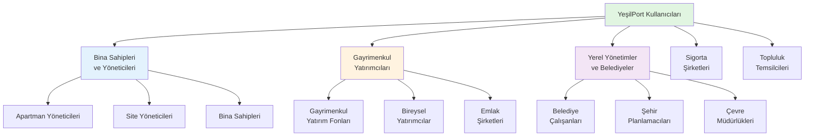
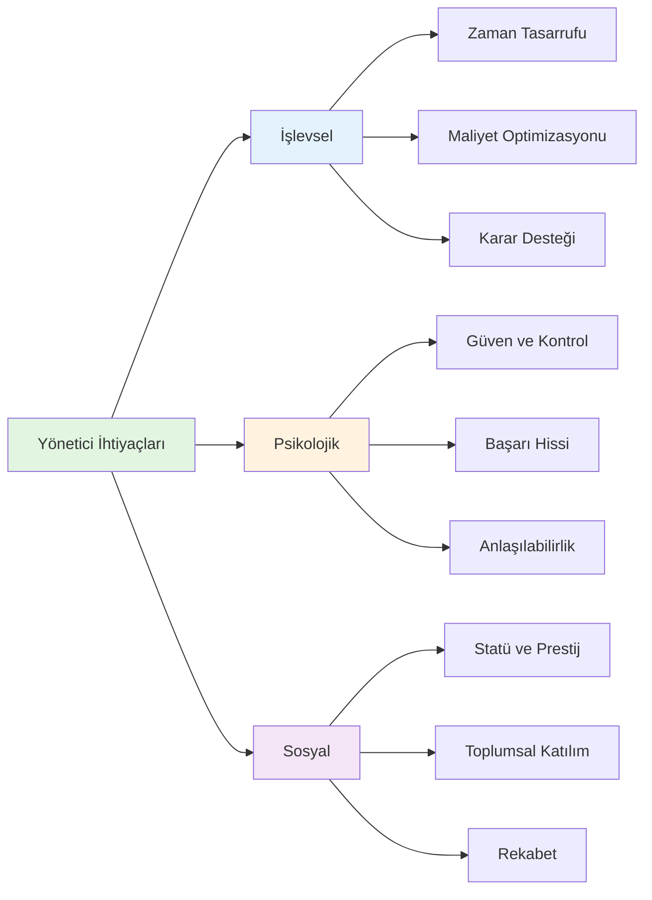
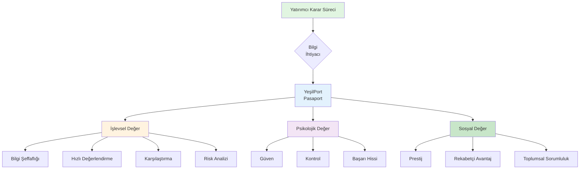
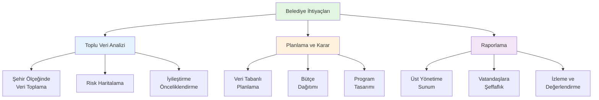

# YeşilPort: Kullanıcı Profilleri ve Değer Analizi

## Giriş

YeşilPort projesi üzerinde çalışırken, tasarımımızın gerçek hayatta nasıl bir etki yaratacağını düşünmek gerekiyor. Bu doküman kapsamında, platformumuzun dokunduğu insanları ve onlara nasıl değer sunduğumuzu analiz edeceğiz. Eğitimde öğrendiğimiz gibi, insanları sadece rasyonel karar veren varlıklar olarak değil, kültürel, psikolojik ve sosyal ihtiyaçları olan bireyler olarak ele alıyoruz.

---

## 1. Tasarımın Başarısını En Çok Etkileyecek İnsanlar

YeşilPort, dijital bina pasaportu platformu olarak birçok farklı paydaşla etkileşime giriyor. Projeyi düşündüğümüzde, başarısını en çok etkileyecek insanları şu şekilde kategorize edebiliriz:

Bu dokümanda, en kritik üç profili derinlemesine inceleyeceğiz:

1. **Apartman/Site Yöneticileri** - Platformun birincil kullanıcıları
2. **Gayrimenkul Yatırımcıları** - Karar vericiler ve finansal güç
3. **Belediye Çalışanları ve Şehir Planlamacıları** - Sistemik etki yaratabilecek kullanıcılar

---

## 2. Profil Analizleri

### 2.1 Profil 1: Apartman/Site Yöneticileri

#### Kimler?

Apartman veya site yöneticileri, YeşilPort'un en doğrudan kullanıcıları. Bu kişiler, binaların günlük işleyişinden sorumlu, sakinlerle sürekli iletişim halinde olan ve bina performansı hakkında kararlar alan kişiler.

#### Nasıl Canlanıyorlar?

**Yaş ve Deneyim:**
- Genellikle 35-60 yaş aralığında
- Çoğunlukla emekli olmuş veya yarı zamanlı çalışan kişiler
- Bina yönetimi konusunda 5-15 yıl arası deneyime sahipler
- Teknik bilgileri sınırlı ama pratik deneyimleri yüksek

**Kültürel ve Sosyal Özellikler:**
- Türkiye'nin farklı bölgelerinden geliyorlar ama çoğunlukla şehirli kültüre sahipler
- Geleneksel değerlerle modern ihtiyaçlar arasında denge kurmaya çalışıyorlar
- Toplumsal sorumluluk duyguları güçlü - "bizim bina" diye düşünüyorlar
- Sakinlerle yakın ilişkiler kuruyorlar, mahalle kültürünün bir parçası

**Teknoloji ve Medya Alışkanlıkları:**
- WhatsApp ve telefon aramaları birincil iletişim araçları
- Facebook ve Instagram kullanıyorlar ama pasif kullanıcılar
- Mobil uygulamalara aşinaları var ama karmaşık sistemlerden kaçınıyorlar
- Excel ve basit formlar kullanıyorlar (aylık gider hesaplamaları için)
- Blockchain, karbon ayak izi gibi kavramlar onlar için yeni ve karmaşık

**Değerler ve Motivasyonlar:**
- Güvenilirlik ve şeffaflık çok önemli
- "İşimi doğru yapıyorum" hissi onlar için kritik
- Sakinlerin memnuniyeti ön planda
- Bütçe yönetimi ve tasarruf konularında hassaslar
- Çevre konularına ilgili ama öncelikleri farklı (maliyet > çevre)

**Tasarıma Dair Fikirleri:**
- Basit ve anlaşılır olmalı - "teknik jargon" istemiyorlar
- Hızlı sonuç almak istiyorlar - uzun formlar doldurmak istemiyorlar
- Görsel ve somut çıktılar tercih ediyorlar (skorlar, renkli göstergeler)
- "Bu benim işime yarayacak mı?" sorusu sürekli kafalarında

#### Problemleri ve İhtiyaçları

**İşlevsel İhtiyaçlar:**
- Bina performansını hızlıca değerlendirebilmek
- Sakinlere rapor sunabilmek (özellikle yönetim kurulu toplantılarında)
- Enerji maliyetlerini azaltmak için somut öneriler almak
- Bina bakım planlaması yapabilmek
- Yasal gereklilikleri yerine getirebilmek (enerji kimlik belgesi gibi)

**Psikolojik İhtiyaçlar:**
- "Ben iyi bir yöneticiyim" hissini yaşamak
- Sakinlerin gözünde güvenilir görünmek
- Karmaşık konuları anlayabilmek ve açıklayabilmek
- Gelecek kaygısı: "Bina eskidikçe ne olacak?" sorusu

**Sosyal İhtiyaçlar:**
- Toplumsal saygı görmek
- "Bizim bina çevre dostu" diyebilmek
- Komşu binalarla karşılaştırma yapabilmek
- Yönetim kurulunda başarılı görünmek

#### Tasarımın Sunduğu Değerler

**İşlevsel Değer:**
- **Zaman Tasarrufu:** Manuel hesaplamalar yerine otomatik analiz. Örneğin, enerji sınıfı hesaplaması için saatlerce uğraşmak yerine 10 dakikada sonuç almak.
- **Maliyet Optimizasyonu:** İyileştirme önerileri sayesinde hangi yatırımın ne kadar tasarruf sağlayacağını görmek. "Bu yalıtım yatırımı 3 yılda kendini amorti edecek" gibi somut bilgiler.
- **Karar Desteği:** Yönetim kurulu toplantılarında "BRI rating'imiz B, şu iyileştirmelerle A'ya çıkarabiliriz" gibi veri tabanlı sunumlar yapabilmek.

**Psikolojik Değer:**
- **Güven ve Kontrol:** Blockchain üzerinde saklanan veriler sayesinde "Bu veriler güvenli ve değiştirilemez" hissi. Özellikle eski binalar için "Binanın durumu ne?" kaygısını azaltmak.
- **Başarı Hissi:** Yüksek BRI rating'i veya iyileştirme sonrası skor artışı görmek, "Ben bu binayı iyi yönetiyorum" duygusu yaratıyor.
- **Anlaşılabilirlik:** Karmaşık teknik terimler yerine görsel skorlar (AA, A, B gibi) ve renkli göstergeler, "Ben bunu anlıyorum" hissi veriyor.

**Sosyal Değer:**
- **Statü ve Prestij:** "Bizim bina AA rating'li" diyebilmek, yönetici olarak saygı görmek. Özellikle çevre bilinci artan toplumda bu önemli.
- **Toplumsal Katılım:** "Biz de sürdürülebilirliğe katkı sağlıyoruz" hissi. İklim değişikliği konusunda farkındalık artıyor ve insanlar bu konuda bir şeyler yapmak istiyor.
- **Rekabet ve Karşılaştırma:** Komşu binalarla karşılaştırma yapabilmek. "Bizim bina mahalledeki en iyi rating'e sahip" gibi gurur duyulacak durumlar.

---

### 2.2 Profil 2: Gayrimenkul Yatırımcıları

#### Kimler?

Gayrimenkul yatırımcıları, binaları satın alan, satan veya yatırım amaçlı değerlendiren kişiler. Bunlar hem bireysel yatırımcılar hem de kurumsal yatırım fonları olabilir. YeşilPort için kritik çünkü onlar karar vericiler ve finansal güce sahipler.

#### Nasıl Canlanıyorlar?

**Yaş ve Profesyonel Özellikler:**
- İki ana grup var: Genç profesyoneller (28-40 yaş) ve deneyimli yatırımcılar (45-65 yaş)
- Genç grup: Teknolojiye aşina, sürdürülebilirlik konularına ilgili, ESG (Environmental, Social, Governance) kriterlerini biliyorlar
- Deneyimli grup: Geleneksel yatırım mantığı, "para kazanmak" odaklı, ama yeni trendleri takip ediyorlar
- Çoğunlukla üniversite mezunu, finans veya işletme geçmişi var

**Kültürel ve Sosyal Özellikler:**
- Şehirli, modern yaşam tarzına sahipler
- Global trendleri takip ediyorlar (özellikle genç grup)
- Networking önemli - LinkedIn aktif kullanıcıları
- "Akıllı yatırım" yapmak istiyorlar - sadece kısa vadeli kâr değil, uzun vadeli değer de önemli
- Çevre bilinci artıyor, özellikle genç yatırımcılar için ESG kriterleri önemli

**Teknoloji ve Medya Alışkanlıkları:**
- Teknoloji kullanıcıları - mobil uygulamalar, web platformları rahat kullanıyorlar
- LinkedIn, Twitter, finans haber siteleri takip ediyorlar
- Veri analizi araçlarına aşinalar (Excel, grafikler, raporlar)
- Blockchain ve kripto konularına ilgili (özellikle genç grup)
- Hızlı karar vermek için hızlı bilgi erişimi istiyorlar

**Değerler ve Motivasyonlar:**
- **Risk Yönetimi:** Yatırım yaparken riskleri minimize etmek istiyorlar
- **Şeffaflık:** Satın alacakları binanın gerçek durumunu bilmek istiyorlar
- **Rekabetçilik:** Diğer yatırımcılardan önce iyi fırsatları yakalamak
- **Sürdürülebilirlik:** Uzun vadeli değer yaratmak, çevre dostu yatırımlar yapmak (özellikle genç grup)
- **Veri Odaklılık:** Duygusal kararlar yerine veri tabanlı kararlar vermek

**Tasarıma Dair Fikirleri:**
- Profesyonel görünmeli - "bu ciddi bir platform"
- Hızlı ve verimli olmalı - "zamanım değerli"
- Karşılaştırma yapabilmeli - "bu bina diğerlerinden nasıl?"
- Güvenilir olmalı - "bu verilere güvenebilir miyim?"
- Blockchain entegrasyonu onlar için artı değer - "değiştirilemez kayıt" güven veriyor

#### Problemleri ve İhtiyaçları

**İşlevsel İhtiyaçlar:**
- **Bilgi Asimetrisi:** Satın alırken binanın gerçek durumunu bilmek. "Bu bina depreme dayanıklı mı?", "Enerji maliyetleri ne kadar?", "Bakım giderleri yüksek mi?" gibi sorular.
- **Karşılaştırma:** Farklı binaları karşılaştırabilmek. "Bu bina mahalledeki diğer binalardan daha mı iyi?"
- **Risk Değerlendirmesi:** Yatırım riskini ölçebilmek. "Bu bina gelecekte değer kaybeder mi?", "İyileştirme maliyetleri ne kadar?"
- **Hızlı Karar:** Zamanında karar verebilmek için hızlı bilgi erişimi.

**Psikolojik İhtiyaçlar:**
- **Güven:** Yatırım yaparken "doğru karar veriyorum" hissi. Özellikle büyük yatırımlarda kaygı yüksek.
- **Kontrol:** Binanın durumunu kontrol edebilmek, "her şeyi biliyorum" hissi.
- **Başarı:** İyi yatırım yapmak, "akıllı yatırımcıyım" hissi.

**Sosyal İhtiyaçlar:**
- **Prestij:** "Ben sürdürülebilir yatırımlar yapıyorum" diyebilmek. Özellikle ESG trendi artıyor.
- **Rekabet:** Diğer yatırımcılardan önce iyi fırsatları yakalamak.
- **Toplumsal Sorumluluk:** "Ben de çevreye katkı sağlıyorum" hissi.

#### Tasarımın Sunduğu Değerler

**İşlevsel Değer:**
- **Bilgi Şeffaflığı:** Blockchain üzerinde saklanan, değiştirilemez veriler sayesinde binanın gerçek durumunu görmek. "Bu veriler güvenilir mi?" sorusunu ortadan kaldırmak.
- **Hızlı Değerlendirme:** Pasaport ID'si ile birkaç saniyede binanın tüm performans verilerine ulaşmak. Emlak görüşmelerinde "Hemen kontrol edeyim" diyebilmek.
- **Karşılaştırma Aracı:** Farklı binaların BRI rating'lerini, enerji sınıflarını, karbon ayak izlerini karşılaştırabilmek. "Bu bina mahalledeki en iyi rating'e sahip" gibi objektif karşılaştırmalar.
- **Risk Analizi:** BRI rating'i sayesinde yatırım riskini ölçebilmek. "AA rating'li bina = düşük risk" gibi net korelasyonlar.

**Psikolojik Değer:**
- **Güven ve Huzur:** Blockchain kayıtları sayesinde "Bu veriler manipüle edilemez" hissi. Özellikle büyük yatırımlarda kritik.
- **Kontrol Hissi:** Binanın tüm özelliklerini tek bir yerde görmek, "Her şeyi biliyorum, kontrol bende" hissi.
- **Başarı ve Akıllılık:** Veri tabanlı karar vermek, "Ben akıllı yatırımcıyım, verilerle karar veriyorum" hissi.

**Sosyal Değer:**
- **Prestij ve Statü:** "Ben sürdürülebilir yatırımlar yapıyorum" diyebilmek. ESG kriterleri giderek önemli hale geliyor.
- **Rekabetçi Avantaj:** Diğer yatırımcılardan önce bilgiye ulaşmak, "Ben daha hızlı karar verebiliyorum" avantajı.
- **Toplumsal Sorumluluk:** "Ben de iklim değişikliğiyle mücadeleye katkı sağlıyorum" hissi. Özellikle genç yatırımcılar için önemli.

---

### 2.3 Profil 3: Belediye Çalışanları ve Şehir Planlamacıları

#### Kimler?

Belediye çalışanları, şehir planlamacıları ve çevre müdürlüğü çalışanları. Bunlar YeşilPort'un sistemik etki yaratabileceği kullanıcılar. Toplu veri analizi yaparak şehir ölçeğinde kararlar alabilirler.

#### Nasıl Canlanıyorlar?

**Yaş ve Profesyonel Özellikler:**
- Geniş bir yaş aralığı: 25-55 yaş arası
- Çoğunlukla mühendis, mimar, şehir plancısı veya çevre mühendisi geçmişine sahipler
- Kamu sektöründe çalışıyorlar, bürokratik süreçlere aşinalar
- Veri toplama ve analiz konularında deneyimliler ama modern araçlar kullanmakta zorlanabiliyorlar
- "Şehir için en iyisini yapmak" motivasyonu güçlü

**Kültürel ve Sosyal Özellikler:**
- Toplumsal sorumluluk duyguları çok güçlü - "halka hizmet" anlayışı
- Sürdürülebilirlik konularına ilgili ama bütçe kısıtları var
- Farklı şehirlerden, farklı kültürel geçmişlere sahipler
- "Bizim şehrimiz" diye düşünüyorlar, aidiyet duygusu güçlü
- Politik baskılar altında çalışıyorlar, "doğru karar vermek" zorunda

**Teknoloji ve Medya Alışkanlıkları:**
- Excel, GIS (Coğrafi Bilgi Sistemleri) gibi araçlara aşinalar
- Web tabanlı sistemler kullanıyorlar ama karmaşık sistemlerden kaçınıyorlar
- Raporlama ve sunum yapıyorlar - görselleştirme önemli
- Blockchain gibi yeni teknolojilere ilgili ama şüpheci yaklaşıyorlar ("gerçekten güvenilir mi?")
- Mobil uygulamalar kullanıyorlar ama masaüstü tercih ediyorlar

**Değerler ve Motivasyonlar:**
- **Toplumsal Fayda:** "Şehrimiz için en iyisini yapmak" öncelikli
- **Veri Odaklı Karar:** Duygusal değil, veri tabanlı kararlar vermek istiyorlar
- **Şeffaflık:** Vatandaşlara karşı şeffaf olmak, "ne yaptığımızı göstermek"
- **Sürdürülebilirlik:** Uzun vadeli planlama, gelecek nesilleri düşünmek
- **Etkinlik:** Sınırlı kaynaklarla maksimum etki yaratmak

**Tasarıma Dair Fikirleri:**
- Toplu veri analizi yapabilmeli - "şehrimizdeki binaların durumu ne?"
- Raporlama ve sunum için uygun olmalı - "belediye meclisine sunabilir miyim?"
- Güvenilir olmalı - "bu verilere güvenebilir miyiz?"
- Erişilebilir olmalı - "vatandaşlar da görebilmeli"
- Entegre olabilmeli - "mevcut sistemlerimizle uyumlu mu?"

#### Problemleri ve İhtiyaçları

**İşlevsel İhtiyaçlar:**
- **Veri Toplama:** Şehirdeki binaların durumunu toplu olarak görmek. "Hangi bölgelerde risk var?", "Hangi binalar iyileştirme gerektiriyor?"
- **Planlama:** İyileştirme programları planlamak. "Hangi bölgelere öncelik vermeliyiz?", "Bütçe nasıl dağıtılmalı?"
- **Raporlama:** Üst yönetime ve vatandaşlara rapor sunmak. "Şehrimizdeki binaların %X'i A sınıfı enerji verimliliğine sahip" gibi.
- **İzleme:** İyileştirme programlarının etkisini ölçmek. "Bu program başarılı mı?", "Hedeflerimize ulaştık mı?"

**Psikolojik İhtiyaçlar:**
- **Başarı Hissi:** "Ben şehrim için iyi işler yapıyorum" hissi. Özellikle zorlu bürokratik süreçlerde motivasyon önemli.
- **Güven:** "Bu verilere güvenebilirim, doğru kararlar veriyorum" hissi.
- **Anlaşılabilirlik:** Karmaşık verileri basit şekilde sunabilmek, "herkes anlayabilsin" isteği.

**Sosyal İhtiyaçlar:**
- **Toplumsal Tanınma:** "Biz sürdürülebilir bir şehir yaratıyoruz" diyebilmek.
- **Şeffaflık:** Vatandaşlara karşı şeffaf olmak, "ne yaptığımızı gösteriyoruz" hissi.
- **Rekabet:** Diğer şehirlerle karşılaştırma yapabilmek. "Bizim şehrimiz en sürdürülebilir" gibi.

#### Tasarımın Sunduğu Değerler

**İşlevsel Değer:**
- **Toplu Veri Analizi:** Şehirdeki tüm binaların pasaport verilerini toplu olarak analiz edebilmek. "İlçemizdeki binaların ortalama BRI rating'i B, şu bölgelerde iyileştirme gerekiyor" gibi.
- **Haritalama:** Coğrafi olarak risk haritaları oluşturabilmek. "Hangi mahallelerde yüksek risk var?" gibi görselleştirmeler.
- **Planlama Desteği:** İyileştirme programları için veri tabanlı planlama. "Bu bölgeye öncelik vermeliyiz çünkü risk yüksek" gibi.
- **İzleme ve Değerlendirme:** Programların etkisini ölçmek. "Bu program sonrası binaların rating'i artmış mı?" gibi.

**Psikolojik Değer:**
- **Başarı ve Etki:** "Ben şehrim için somut işler yapıyorum" hissi. Veri tabanlı kararlar sayesinde "doğru yoldayım" hissi.
- **Güven:** Blockchain kayıtları sayesinde "Bu veriler güvenilir, manipüle edilemez" hissi.
- **Anlaşılabilirlik:** Karmaşık verileri görsel ve anlaşılır şekilde sunmak, "herkes anlayabilsin" isteğini karşılamak.

**Sosyal Değer:**
- **Toplumsal Tanınma:** "Biz sürdürülebilir bir şehir yaratıyoruz" diyebilmek. Özellikle ulusal/uluslararası platformlarda şehri tanıtmak.
- **Şeffaflık:** Vatandaşlara karşı şeffaf olmak, "ne yaptığımızı gösteriyoruz" hissi. Blockchain sayesinde "veriler manipüle edilemez" güvencesi.
- **Rekabet ve Prestij:** Diğer şehirlerle karşılaştırma yapabilmek. "Bizim şehrimiz en sürdürülebilir" gibi prestij.

---

## 3. Genel Değer Önerisi ve Etkileşim

Üç profili inceledikten sonra, YeşilPort'un ortak değer önerilerini şu şekilde özetleyebiliriz:

### 3.1 Ortak İhtiyaçlar

Tüm profiller için ortak olan ihtiyaçlar:

1. **Güvenilirlik:** Verilerin doğru ve manipüle edilemez olması
2. **Anlaşılabilirlik:** Karmaşık teknik bilgilerin basit ve görsel şekilde sunulması
3. **Hızlı Erişim:** Bilgiye hızlıca ulaşabilmek
4. **Karşılaştırma:** Farklı binaları karşılaştırabilmek
5. **Sürdürülebilirlik:** Çevre dostu kararlar alabilmek

### 3.2 Profil Bazlı Öncelikler

```mermaid
graph TB
    A[YeşilPort<br/>Değer Önerisi] --> B[Yöneticiler]
    A --> C[Yatırımcılar]
    A --> D[Belediyeler]
    
    B --> B1[Hızlı Sonuç]
    B --> B2[Basit Arayüz]
    B --> B3[Sakinlere Sunum]
    B --> B4[Maliyet Tasarrufu]
    
    C --> C1[Bilgi Şeffaflığı]
    C --> C2[Risk Analizi]
    C --> C3[Karşılaştırma]
    C --> C4[Blockchain Güvencesi]
    
    D --> D1[Toplu Analiz]
    D --> D2[Haritalama]
    D --> D3[Raporlama]
    D --> D4[Planlama Desteği]
    
    style A fill:#4caf50,stroke:#2e7d32,stroke-width:3px,color:#fff
    style B fill:#2196f3,stroke:#1565c0,stroke-width:2px,color:#fff
    style C fill:#9c27b0,stroke:#6a1b9a,stroke-width:2px,color:#fff
    style D fill:#ff9800,stroke:#e65100,stroke-width:2px,color:#fff
    style B1 fill:#64b5f6,stroke:#1976d2,stroke-width:1px,color:#000
    style B2 fill:#64b5f6,stroke:#1976d2,stroke-width:1px,color:#000
    style B3 fill:#64b5f6,stroke:#1976d2,stroke-width:1px,color:#000
    style B4 fill:#64b5f6,stroke:#1976d2,stroke-width:1px,color:#000
    style C1 fill:#ba68c8,stroke:#7b1fa2,stroke-width:1px,color:#fff
    style C2 fill:#ba68c8,stroke:#7b1fa2,stroke-width:1px,color:#fff
    style C3 fill:#ba68c8,stroke:#7b1fa2,stroke-width:1px,color:#fff
    style C4 fill:#ba68c8,stroke:#7b1fa2,stroke-width:1px,color:#fff
    style D1 fill:#ffb74d,stroke:#e65100,stroke-width:1px,color:#000
    style D2 fill:#ffb74d,stroke:#e65100,stroke-width:1px,color:#000
    style D3 fill:#ffb74d,stroke:#e65100,stroke-width:1px,color:#000
    style D4 fill:#ffb74d,stroke:#e65100,stroke-width:1px,color:#000
```

### 3.3 Tasarım Kararlarına Yansıma

Bu analiz sonucunda, tasarım kararlarımızı şu şekilde şekillendirebiliriz:

1. **Basit ve Anlaşılır Arayüz:** Tüm profiller için karmaşık teknik terimler yerine görsel skorlar (AA, A, B gibi) ve renkli göstergeler.

2. **Hızlı Erişim:** Pasaport ID'si ile birkaç saniyede bilgiye ulaşabilme. Özellikle yatırımcılar için kritik.

3. **Blockchain Güvencesi:** Tüm profiller için güvenilirlik sağlayan, değiştirilemez kayıtlar.

4. **Görselleştirme:** Karmaşık verilerin grafikler, haritalar ve renkli göstergelerle sunulması.

5. **Karşılaştırma Özellikleri:** Farklı binaları karşılaştırabilme imkanı.

6. **Toplu Analiz:** Belediyeler için şehir ölçeğinde veri analizi yapabilme.

---

## Sonuç

Bu doküman kapsamında, YeşilPort'un dokunduğu üç kritik profili derinlemesine inceledik. Her profil için işlevsel, psikolojik ve sosyal değerleri analiz ettik. 

Öğrendiğimiz en önemli şey, insanların sadece "işlevsel" ihtiyaçları olmadığı. Yöneticiler "zaman tasarrufu" istiyor ama aynı zamanda "başarı hissi" de istiyorlar. Yatırımcılar "bilgi şeffaflığı" istiyor ama aynı zamanda "prestij" de istiyorlar. Belediye çalışanları "toplu veri analizi" istiyor ama aynı zamanda "toplumsal tanınma" da istiyorlar.

YeşilPort olarak, sadece teknik bir çözüm sunmak yerine, bu insanların tüm ihtiyaçlarını karşılayan bir platform yaratmaya çalışıyoruz. Blockchain güvencesi, görsel skorlar, karşılaştırma özellikleri gibi her özellik, bu profillerin ihtiyaçlarından yola çıkarak tasarlandı.

Gelecekte, bu analizi daha da derinleştirerek, her profil için özelleştirilmiş deneyimler sunabiliriz. Örneğin, yöneticiler için "hızlı rapor oluşturma", yatırımcılar için "risk analizi dashboard'u", belediyeler için "şehir ölçeğinde haritalama" gibi.

---

**Not:** Bu analiz, eğitimde öğrendiğimiz "insanı merkeze alan tasarım" yaklaşımına dayanarak yapıldı. İnsanları sadece rasyonel karar veren varlıklar olarak değil, kültürel, psikolojik ve sosyal ihtiyaçları olan bireyler olarak ele aldık.

